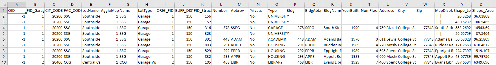

# TAMU GIS Programming: Homework 04
>
>**Topic:** Fun with arcpy

# **Outcomes**
1. Learn how to build an iterator.
2. Learn several of the general purpose container data types.
3. Learn how to use Arcpy to 1) setup a workspace; 2) create a geodatabase; and 3) find example arcpy code.
4. Learn how to manipulate feature layers and perform some basic spatial analysis (e.g. buffering, intersection) using arcpy.

# **Task:**
<!-- > 1. Read x/y coords + another text attribute (name) from text file
> 2. Create file geodatabase with a point layer
> 3. Buffer points
> 4. Intersect with a second shapefile (lines) they need to download (line, id, name)
> 5. Output table of line segment names that intersect with each buffered point (File = PointId, PointName, LineId, LineName) -->
> 1. Read in garage location X/Y coords from the provided .csv
> 2. Create a geodatabase and add in the input layers
> 3. Buffer the garage points
> 4. Intersect the buildings layer with the buffered garage points
> 5. Output the resulting table to a .csv

# **To Hand In:**
1. Link to your Github page that contains the Python code, GDB, and CSV resulting table.
2. Screenshot of the executed code.
> 
# Fun with arcpy
In this homework assignment, you will be creating a Python script that will determine which buildings on TAMU's main campus intersect with it's various garages.
## 1. Read x/y coords
Using the text file [here](../data/homework/04/garages.csv), read in these data points. These are the locations of various parking garages around the TAMU campus.
## 2. Create a geodatabase
With your text file parsed and your garage points available, create a new geodatabase and add in the garage data. Once you have garages added in, use the **Structures** layer in the **Campus.gdb** found [here](../data/homework/04/Campus.gdb) for the intersection. You'll probably want to copy the **Structures** feature class into your geodatabase.
## 3. Buffer the garages
Use the buffer tool covered in the "Basic operations" lecture to create a buffer around the garages. You should get the buffer distance value from the user using the **input()** method covered previously. The distance for the buffer should be in meters.
## 4. Intersect the two files
With both the garage layer and the building layers present, perform an intersection on these two layers and add the resulting layer to your geodatabase.
## 5. Output the intersection table
With your intersection complete, output the resulting layer's attribute table as a .csv.

>

>
