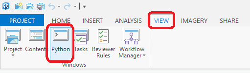

# TAMU GIS Programming
# Learning Objectives
- Explain different types of programming / languages
- Detail why ArcGIS Pro / Desktop use Python
- Explain what Python is
- Detail what a package manager is (Conda and Pip)
>
# Introduction to GIS Programming
Programming comes in a variety of flavors be it desktop programming such as Google's Chrome or mobile such as any Android app. In addition to all the different types of programming there are a multitude of different programming languages. These languages range from those used extensively such as C/C++, Java, C#, Javascript, and Python to those few have heard of, such as Erlang, Haskell, or Delphi. Every programming language has its fans and its uses; its pluses and its minuses. It is up to the programmer to decide what is the best programming language for the task at hand.
>
Consider a task you need to complete as a bookshelf you're putting together from Walmart or Ikea. Obviously you'd use a hammer to drive the nails through the backing into the bookshelf, but you could always use the broad side of a crecent wrench if you wanted to. Sure it's not the *BEST* way to go about it but it works with a little more effort. The same can be said of programming. There are times where a certain language is the proper tool of choice such as using C# and PHP for web backends and Java for Android apps. You *COULD* use any language for the web backend but it would require more work on your part. Once again, it is up to you to decide which tool is pertinent. Choose the wrong tool and you may end up overcomplicating things or you may not finish at all.
>

## Main types of GIS programming
### Automation
Some GIS tasks are really basic, really boring, and have to be done all the time. These are the exact types of tasks that you probably wish you could get a computer to do for you. These could include things like:
- Every morning, you get an email containing a excel sheet with GPS coordinates in it that you have to import into ArcMap, buffer, then intersect with another polygon layer, then output to a file to send to someone else.
- Every afternoon, you have to export data from your ArcGIS portal to a CSV list to email to somebody else.

Luckily, you never have to do these things by hand, ever again - you can get Python to do them for. This called **GIS automation** and increases your efficiency as a GIS Analyst/Programmer/Tech/Etc because you can write some code that does these simple (and sometime complex) tasks for you, automatically in the background, while your time is better spent doing something more meaningful. ArcPy, Python, and a variety of other tools (bash/batch jobs, any other kind of scripts, etc.) allow you to string together a series of tasks in a row (outpu of one thing becomes the input to another, to the next, next, etc.) so that annoying processes can be run with one click (or with no clicks, as a scheduled job)

## Customization
Sometimes, you wish you could move buttons around and make special toolbars that make your job easier because things are where you need them to be, when you need them there inside of ArcMap/Pro. You can do this, really, really easily, you just never knew that you could. **GIS Customization** is when you build custom toolbars and ribbons to organize the interface of ArcMap/Pro to meet your needs. No programming required, just configuration. Super simple, but helpful.

## Extension
Sometimes, there are things you wish you could make ArcMap/Pro do, that there just are not any buttons or gettable extensions for. In this case, you need develop custom code/tools/interfaces/toolbars/processes/workflows that do the special things you need done. Luckily, you can wrap all of this in the Esri ecosystem (APIs/Code/Interfaces) so that you can make these new awesome things available as buttons that show up inside of ArcMap/Pro.

For example, every extension that you have ever "turned on" in ArcMap/Pro is one of these. FME Data Interoperability Extension, 3D Analyst, etc. - all custom **GIS Extensions**. Basically, when you develop new workflows or functionality that you bring into ArcMap/Pro that extends the capabilities of the platform, you are writing a custom **GIS Extensions**. These can be super simple single buttons that one specific thing, or they can be full on platforms that you integrate with ArcMap/Pro (think FME). 


## GIS programming languages
What do people use when it comes to GIS? Technically any language can be used to do GIS programming. One should consider what third-party libraries, modules, support, and documentation currently exists for a language in question before starting out to do GIS. You wouldn't want to start trying to modify .shp files with Delphi if you have to write all the logic for loading, modifying, and saving said changes yourself. Unless you're just really hardcore about programming then by all means go ahead and do so. Once again, it's all about choosing the proper tool for the job at hand. 
>
There are a variety of programming languages you may use to program GIS that have existing GIS support. ESRI uses C++ for developing ArcGIS. Aggiemap uses ESRI's Javascript API for displaying the map elements and routes. Another language becoming more and more popular with GIS developers is R; some universities are even foregoing the use of traditional GIS software such as ArcGIS or QGIS in favor of teaching R GIS exclusively. A benefit of this route is that students learn how to approach GIS from a programming perspective. This perspective can pay dividends later on in your GIS career as knowing how to program makes you quite invaluable.
>
The biggest player when it comes to GIS programming though at this point and time is Python. How did Python end up on top of the world of GIS programming? Let's find out.
>
# What is Python?
One could argue that the most popular and widespread used languages for GIS programming is Python. According to social coding website Github, Python is "the second most popular language" on their site only after Javascript. How has Python risen to one of the most widely used languages?
>
Part of Python's meteoric rise is due in part to its highly readable syntax. Python prides itself in being "human-readable". That means that Python strives to keep its syntax at a level that anyone can read and figure out what the developer is trying to do. 
>
Probably the most important reason Python is as popular as it is today is due its availability. Python runs on practically any computer and is available on all major operating systems (Windows, MacOS, Linux) thanks to its open-source origins. Open-source means that the source code is free to download and poke around. This also allows you to build Python yourself. Because of this, people are willing to build and release Python for new and even obscure platforms. This makes Python EVERYWHERE.
>
You should be aware of is that Python is an **interpreted** language. This means that the code is executed directly without being compiled beforehand. Compiled languages can take quite a while to turn your code into machine-language instructions. This allows for rapid development as you're not waiting around for your computer to translate things. You can make a change to your code and almost instantly you can see the result. 
>
The last thing you should know about Python is the two distinct versions. You can easily find a download for Python 2.7.X or Python 3.6.X (the X is any integer). Version 2 of Python hasn't had a major release since 2010 while Python 3 was released in 2008 and is constantly receiving updates. Please note that Python 3 is the future which is why ESRI has decided to use Python 3 with ArcGIS Pro whereas Python 2 was used in ArcMap.
>
```python
name = input('Hello, what is your name?\n')
print("Howdy, ", name)
```
> ##### Example of a simple Python 3 script
>
Being simple, open, quick, free, and widely available are all reasons why Python has exploded in popularity and has found itself in the forefront of GIS development.
## Package managers
What is a package manager? Package managers are programs which manage the getting of and installation of software for you. They are usually used for third-party software libraries though in the case of Linux a package manager is used for lots of different programs other than programming libraries. If you're familiar with programming on Debian based Linux distributions you may have used `apt-get` or if you're a Mac user you may have used `brew`. These are both examples of system level package managers. But lets dive into package manager usage in Python.
> 
With Python, there are two main package managers: **Conda** and **pip**. Conda is the most widely used package manager and is ESRI's package manager of choice for ArcGIS Pro. Think of Conda as a Python program that can download and install Python libraries and code for you. You simply run a command like this:
>
`conda search beautifulsoup4`
>
And Conda will search the **Anaconda** package index for the package **beautifulsoup4**. If we use the command instead, we'll end up installing **beautifulsoup4**.
>
`conda install beautifulsoup4`
>
If you do not feel comfortable with using command line tools, ArcGIS Pro also has an easy to use graphic interface for working with conda.
>
Pip is the other package manager for Python that is widely used by Python libraries found on Github or elsewhere. Though not included with the **arcgispro-py3** Python, it is yet another package manager you can use. You may want to install pip if a particular package you need in Python is not present in the Anaconda package index. 
>
# Programming with ArcGIS Pro
We can do many things with Python in ArcGIS Pro that we normally would do using the user interface. Why use Python to do the tasks I already know you may be asking. Because it's way better to let something do work for you instead of having to do it yourself. Remember work smarter, not harder. We can use Python to rapidly speedup the time it takes for us to do tasks in ArcGIS Pro. In addition to speeding up the process you have a kind of "history" of what you have done. For instance if you have trouble remembering what all you've done to a particular layer in ArcGIS Pro how can you retrace what you've done after many sessions of saving and closing? Maybe it crashed on you without saving your progress? With Python you have a clear **guide** to what you have done as you can just read the code and see the whole process.
>
## Interfacing with ArcGIS Pro through Python
>

> ##### Toggling the ArcGIS Pro Python window
How does one use Python in ArcGIS Pro? Well you can always bring up the Python window. This option will toggle a Python command line that lets you feed in Python commands. This is nice but has it's limitations. There is no way to edit your code quickly. You cannot write one large script and run that through the Python window without copying and pasting which may introduce many errors. There is a better way to utilize Python with ArcGIS Pro called **arcpy**. Arcpy is a Python module from ESRI that allows us to call GIS specific tools and actions with Python code. It is important to note that using Python with ArcGIS Pro such as arcpy does *not* replace the need for ArcGIS Pro. The arcpy module merely interfaces with ArcGIS Pro much like any tool in the Toolbox does. In the next lecture, we will detail how to go about setting a computer up to create arcpy scripts in an efficient way.

## Videos
[Module1-Topic1-Part1](https://youtu.be/pN9F4h0vYWk)

[Module1-Topic1-Part2](https://youtu.be/R--PcvKP03E)
