# TAMU GIS Programming
# Learning Objectives
- Install ArcGIS Pro and arcpy
# The first hurdle
One of the hardest parts of programming, in my opinion, is getting your development environment setup. Luckily getting setup with **arcpy** isn't too bad of an experience compared to many others such as React Native development. You may run into some errors and snags; if you do hopefully your particular issue and solution is outlined below. If not, please do not hesitate to ask on the class Slack channel. This page will be updated with new errors as students experience them.
# Installing ArcGIS Pro
The first step to installing ArcGIS Pro is to download the installer which can be found at this [official esri link](http://links.esri.com/pro/download/current) or [ click here to get an installer from our shared Google drive and may require you to update after you install it](https://drive.google.com/drive/u/0/folders/0APQ05DtLqvp3Uk9PVA). You *will* need an ESRI account to download the installer (if you use the first link). You can only access our shared drive using your TAMU email account. Ask your instructor for more information on how to get TAMU organizational access. 
>
Once you have the installer downloaded, go ahead an start the installer. You downloaded a single installer, yet it will start two different installation processes. The first is actually an extraction process that has you select a location for the installer to be extracted to. 
>
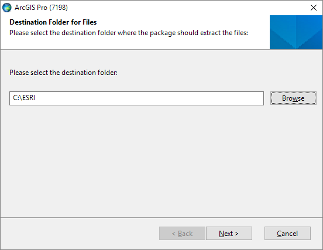
>
I just create an **ESRI** directory on my **C** drive and let it extract inside there. Click **Next** and let it do its thing. Once finished, this will then open up a brand new installer window. This new installer is the one that will actually install ArcGIS Pro to your system.
>
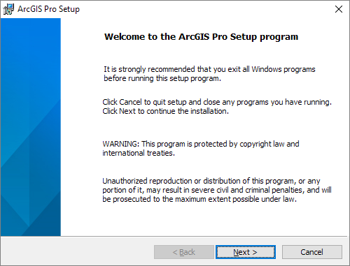
>
Click through the legal-ese as you usually would. You'll then get a prompt asking you who is the application for: just play it safe and select **Anyone who uses this computer (all users)**. If for whatever reason your computer only allows you to select **Only for me** please make a note of it and let me know of this if you have issues later on.
>
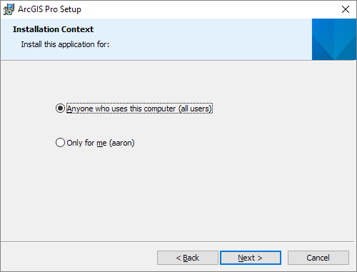
>
Once you've selected who will have access to ArcGIS Pro, go ahead and select the location you'd like ArcGIS Pro to be installed. Unless you have a really good reason not to, I suggest to go ahead and use the default installation location within **Program Files**. Having your installation location in the same place as everyone else will help alleviate any error occurrences later on, as well as make your life easier when it comes to setting environment variables and your path.
>
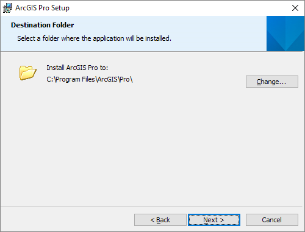
>
Once it's done installing you'll get a screen like this. Go ahead and open up ArcGIS Pro.
>
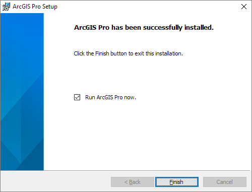
>
Before ArcGIS Pro opens, it should prompt you to log into your ESRI account. Go ahead and log in. Providing your account gives you access to different licensing that A&M has access to such as tools and other extensions. 
>
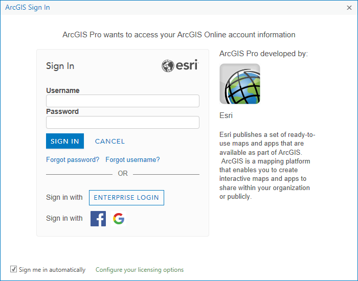
>
Once you've successfully logged in with ESRI, you should be presented with a screen that looks like this.
>
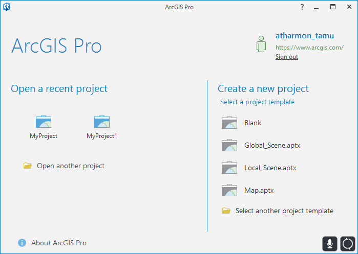
>
You're half way done installing things for GIS development! Now we must move on to making sure **arcpy** is on your computer.
>
# Installing arcpy
>
** **I RECOMMEND TRYING THIS FIRST** **
>
If you update your ArcGIS Pro to version 2.1, it *should* install arcpy for you. This is by far the easiest way to make sure that you have the appropriate **arcgis** package installed along with the **Conda** package manager. 
>
To do this, open up ArcGIS Pro. Look for the **About ArcGIS Pro** button and press it. You should now see a window like this:
>
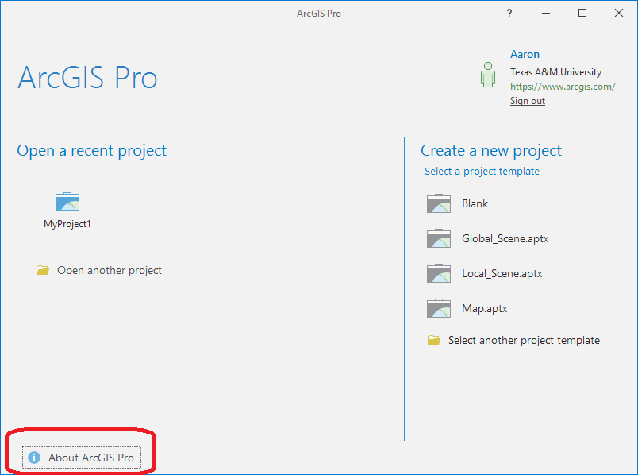
>
Click within the red-circled area. My ArcGIS Pro is currently up to date, but if yours is not, it will say so here. Click there to update your ArcGIS Pro to the latest version. If you have version 2.1.X you should be okay.
>
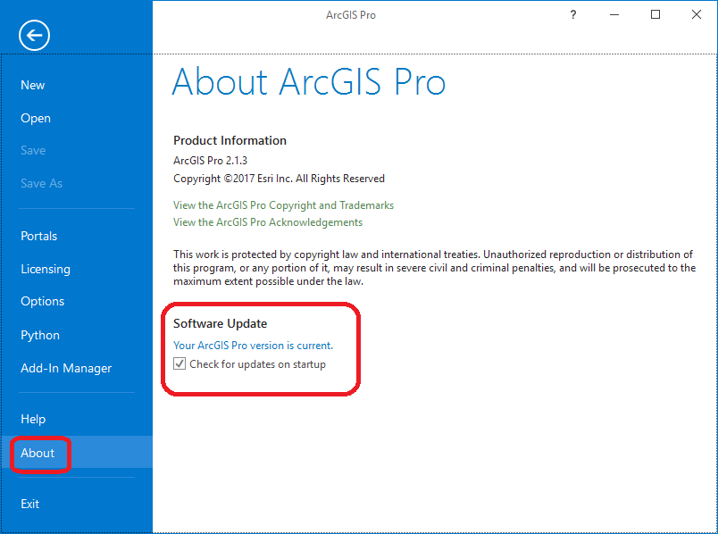
>
## Installing arcpy from user interface
Within the **Home** menu section near the top, you can bring this window below. On the side pane, click on **Python** to open up the graphical Python manager.
>
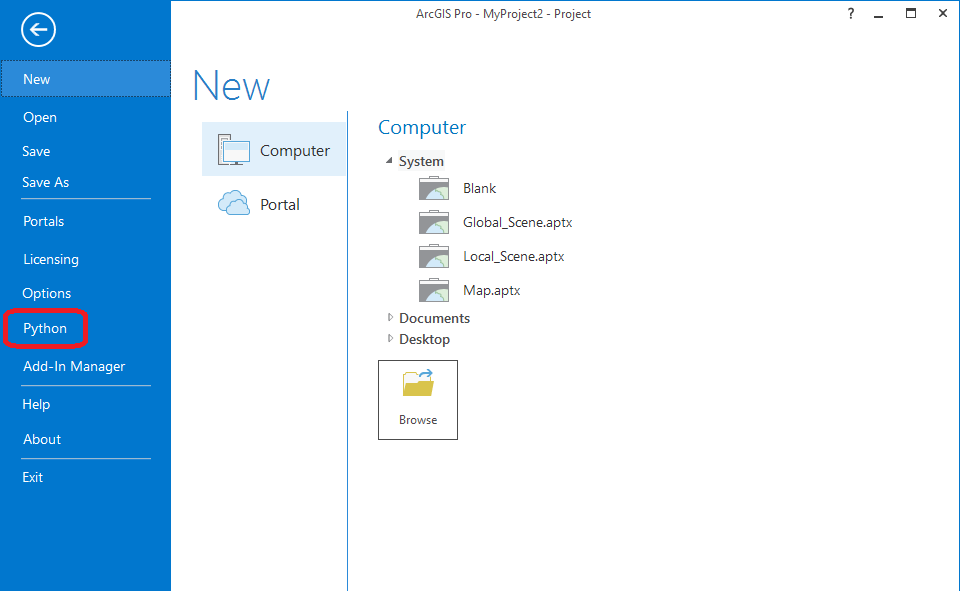
>
With the graphical Python manager window open, click on the **Add Packages** button. When given the option, search for the package **arcgis**. Select the package when it pops up in the results and click **Install**.
>
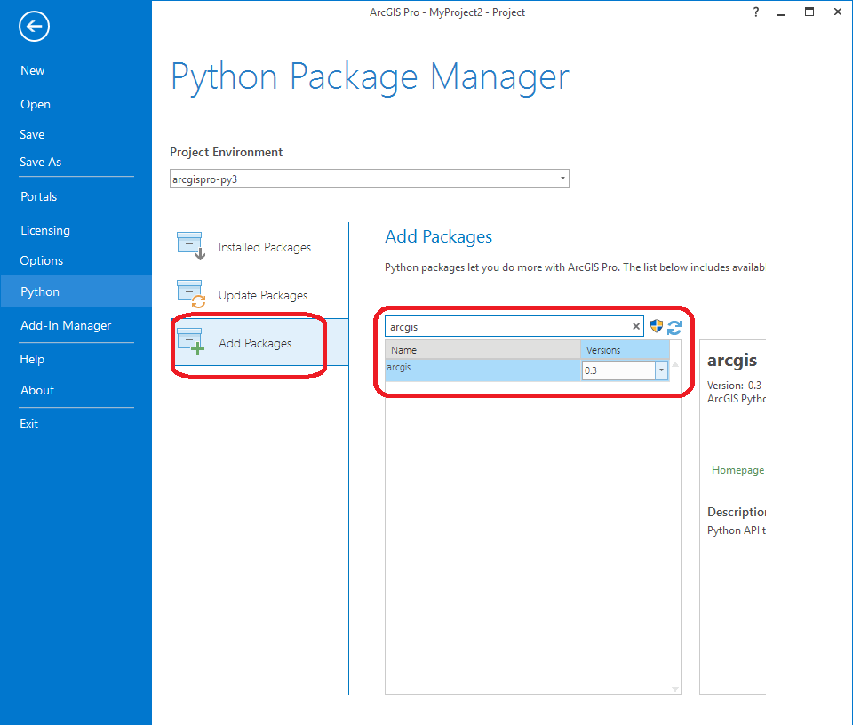
>
<!-- ## Installing arcpy from the command line -->

<!-- # Common errors
Common errors and how to solve them
>
Error Message | Solution
--- | --- -->

>
# Additional resources
If you get lost please consult the official installation documentation or ask a question in the class Slack channel.
- http://pro.arcgis.com/en/pro-app/get-started/install-and-sign-in-to-arcgis-pro.htm
- http://pro.arcgis.com/en/pro-app/arcpy/get-started/installing-python-for-arcgis-pro.htm
- https://developers.arcgis.com/python/guide/install-and-set-up/#Pro1.4 

## Videos
[Module1-Topic2](https://youtu.be/-kdReFGDHTM)
