# TAMU GIS Programming
# Learning Objectives
- Learn the capabilities of Visual Studio Code
- Install Visual Studio Code 
- Install the Python extension
- Run an arcpy Python script
# What can Visual Studio Code do?
The main program we'll be using in this class to do all our work in is a text-editor called **Visual Studio Code**. If you're familiar with Microsoft products you've probably heard of Visual Studio: Microsoft's premier IDE. **Visual Studio Code** (or VSCode or VSC) is an open-source, scaled back version of Visual Studio that can be run on all major platforms (Windows, MacOS, and Linux). Unlike Visual Studio, VSCode is not an integrated development environment (or IDE). Instead, VSCode is a text editor much like Notepad++, meaning that a lot of the more intimidating features present in Visual Studio are absent. One of the advantages to VSCode is the vast amount of community created **extensions** that greatly increase what you can do with VSCode. If you ever want to see what all you can add to your VSCode just take a look at the **Extensions** page found on the left sidepane or by going to `View > Extensions` in the menu bar at the top.
>
# Installing Visual Studio Code
The installer for Visual Studio Code can be found [here](https://code.visualstudio.com/). Make sure you get the **Stable Build** version. This one will keep pesky update messages from bugging you, not to mention it will make sure everyone is running the same version of VSCode. Go ahead and download the installer and run it. This will install Visual Studio Code for you. Don't worry about the installation path; it will not matter where it is installed.
>
## Installing the Python extension
Now it at this point I'd like to point out that we're only going to be installing the plugin for VSCode that introduces Python specific behavior and actions to the text editor. When you install ArcGIS Pro, you're actually getting a copy of Python installed as well; that is the Python we'll be wanting to use when it comes to GIS development. To start, open up Visual Studio Code and go to the menubar up at the top. From there, click on the `View > Extensions` options to bring up the extensions browser. If you have a fresh install of VSCode, you probably have nothing listed here at this point in time. At the top, use the keyword **Python** for the extension search. It will return many different options: look for the extension offered by Microsoft. It may or may not have a star on the top left corner of the extension. Click the green **Install** button to install the Python extension. You will be prompted to restart VSCode, go ahead and do so now.
>
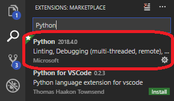
>
At this point you should have the necessary Python extension installed inside your Visual Studio Code text editor. Below we'll see how to go about setting up the extension as to play nicely with arcpy.
## GEOSAD Lab PC: Configuring our Path Variables in Visual Studio Code (ArcGIS Python 3.62)
>
If you are working on a computer connected to the GEOSAD Network, use these steps (assuming you've followed the Python installation steps above):

1. Open Visual Studio Code

2. Click File (top left hand corner) -> Preferences -> Settings
>
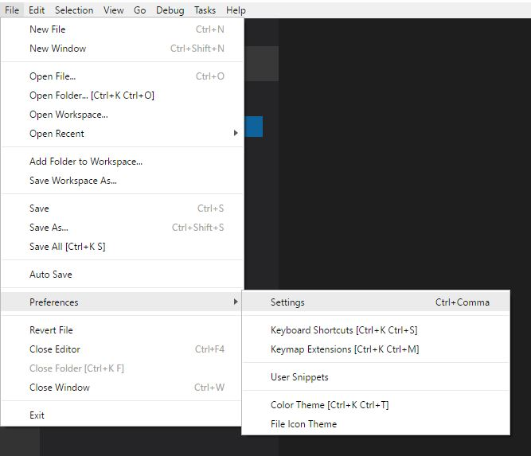
>
3. Now we want to bring up the **Command Palette** which can be brought up with either `View > Command Palette` or with `CTRL + SHIFT + P`. The Command Palette looks like this:
>
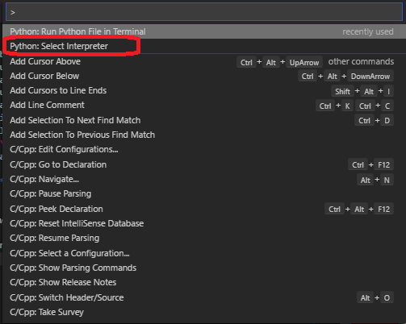
>
4. Select the option **Python: Select Interpreter**. (Or type it in if it dosen't automatically show up)

5. You will see to the right of your screen a thing that looks like this:
>
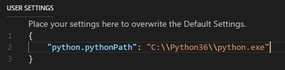
>
6. Type in exactly what you see here:
#### "python.pythonPath": "C:\\Program Files\\ArcGIS\\Pro\\bin\\Python\\envs\\arcgispro-py3\\python.exe"
>
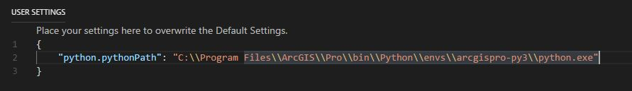
>
7. You're done! You can now start writing ArcPy on the lab computers. Follow the section below to calibrate Python in Visual Studio Code on your personal computer.

## Personal PC: Configuring our Path Variables
>
The first of setting up your Python extension within VSCode is to add the Python interpreter that comes with ArcGIS Pro. To do so, go to your Control Panel and look for the System option or press `Windows key + Pause | Break` to open up the System window. An image of the window we're looking for is found below.
>
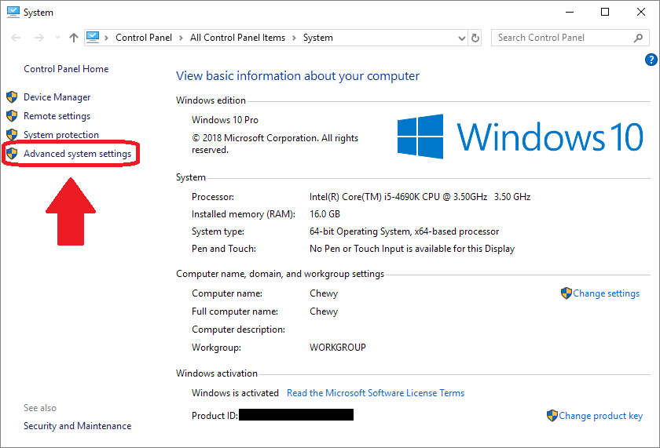
>
Click on the option **Advanced system settings** to bring up the **System properties** window. This window has several tabs near the top, look for the **Advanced** tab and click it.
>
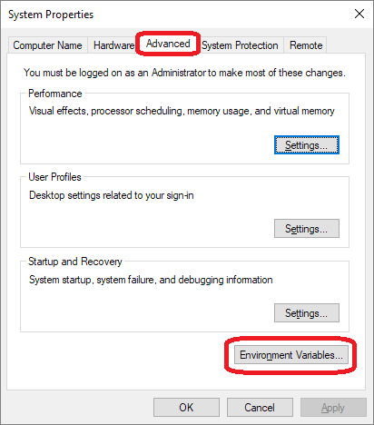
>
At the bottom of the **Advanced** tab, click on the button that is labeled **Environment Variables**. You'll see a window much like the one below. Scroll through both sections until you've found the **Path** environment variable for both user and system variables. Don't worry if your **Path** environment variable doesn't have the same value as the one below or someone elses; everyone's will probably look different. Select the user Path variable and then click **Edit**.
>
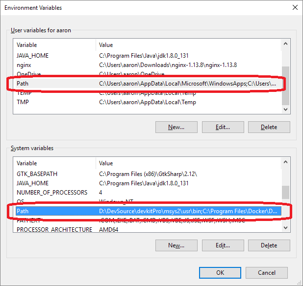
>
You'll now see the different sections of your Path variable. The Path is a very important part of your system: think of the Path as an address book for your command prompt / terminal. Without an entry in our Path environment variables VSCode won't be able to find ArcGIS Python. Within the **Edit** window, click on **Browse** to append a new value to our Path variable. With the **Browse** window open, navigate to your ArcGIS Pro installation folder. You'll want to find a directory inside of here called **arcgispro-py3**; that is the specific Python we want added to our Path variable. With the default installation location selected, Python was found at the following location for me on my computer: `C:\Program Files\ArcGIS\Pro\bin\Python\envs\arcgispro-py3`. Once you've found the folder, click **Ok** to append that location to your user Path. 
>
**Repeat the same process for the system Path variable.**
>
### Personal PC: Setting the interpreter (pt.2)
The last step for setting up Visual Studio Code is to now tell our Python extension which Python interpreter to use. To do so make sure your extension is installed and that VSCode has restarted. Now we want to bring up the **Command Palette** which can be brought up with either `View > Command Palette` or with `CTRL + SHIFT + P`. The Command Palette looks like this:
>

>
Select the option **Python: Select Interpreter**. At the top a box will appear where the Command Palette was that looks like this:
>
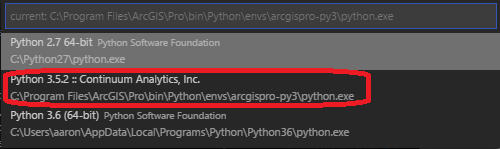
>
If you set your Path variables correctly you should see an option that looks like the one highlighted in the picture above. Select the option located within the **ArcGIS** directory. If you have a version of Python installed on your computer already it may be listed here as well, take care to select the version of Python that comes with ArcGIS Pro. The screen shot shows version 3.5.2 but you may have something else. Just make sure that the interpreter path listed below the interpreter contains the ArcGIS directory.
>
You should now be setup to build and execute arcpy commands within Visual Studio Code!
# Running arcpy
ESRI has a Python library called **arcpy** which is the Python interface for ArcGIS. We use this library, usually called a **module** in Python-world, to do all the GIS work we wish to perform. It is this module that enables Python to do GIS related operations without us having to create our own code to do such things. And since it's made and supported by ESRI it lends a lot of credibility to the module.
>
To get an acrpy script running inside our text editor VSCode, we need to start with a good, well organized directory structure. Don't be the type of person that throws all their files in the desktop, if you do that you're going to have a bad time. I recommend having a class folder with a different work directory per topic such as:
>
`C:\DevSource\GISDev\topic\01`
>
`C:\DevSource\GISDev\topic\02`
>
`C:\DevSource\GISDev\topic\03`
>
where topic 1 material and work goes in `C:\DevSource\GISDev\topic\01` and so on. Go ahead and create your class directory structure now.
>
With that created, it's time to open up this class's main tool: Visual Studio Code. Using VSCode, open up your `GISDev` directory. It should look like the screenshot below.
>
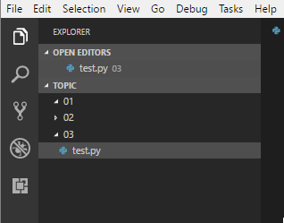
>
Since this is the third class **module**, go ahead and create a new **.py** file inside of your `03` directory. I've named my **test.py** and I would say you do the same, though you can name it whatever you wish. With our Python file created, open it up by clicking on the name within the **Explorer** portion of Visual Studio Code; it should open up a blank file for you.
>
Now, to test if we've properly setup our arcpy and set our interpreter correctly, copy and paste in the following code.
>
```python
import arcpy
print("Success")
```
>
To run our Python script, press the following key combination to bring up the VSCode Command Palette: `CTRL + SHIFT + P`. Type in **Python: Run Python** and select the option that appears.
>
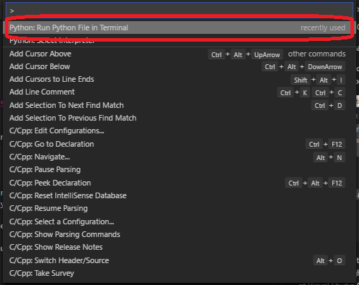
>
One of two things will happen: either a Python window will appear for a brief moment, then disappear. This is because the Python window automatically closes after executing the code. Since it doesn't need to wait for user input, it will close rather quickly. The other possible event is VSCode will open up a window at the bottom of your window. This will then run the program and show you the results.
>
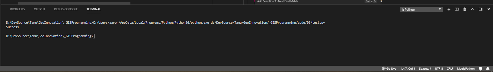
>
# Issues
If you have any issues please ask your questions on the class Slack. I will compile a list of different issues and solutions to add into this document.
>
Common errors and how to solve them
>
Error Message | Solution
--- | ---
`RuntimeError: Not signed into Portal.` | You need to sign into ArcGIS Pro with your Enterprise account.


## Videos
[Module1-Topic3](https://youtu.be/NDB4MLquJcM)
