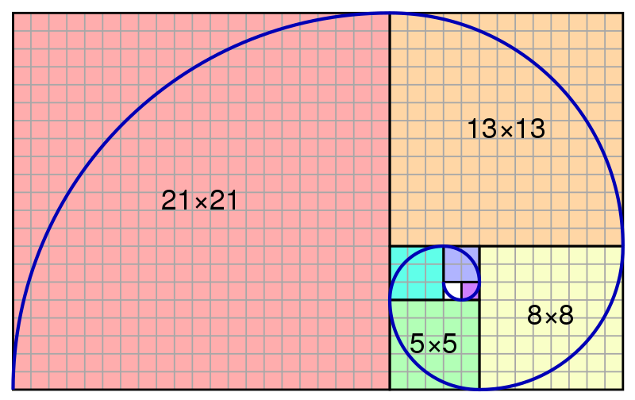
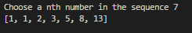
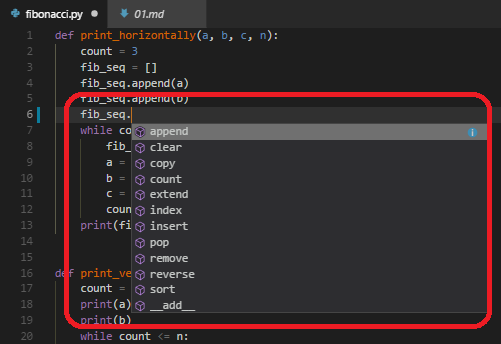

# TAMU GIS Programming
# Learning Objectives
- Outline a way to display the Fibonacci sequence
# Fibonacci numbers
Hopefully by now you should feel a little comfortable with Python programming. We've covered variables, data types, conditionals, loops, scope, and functions which are more than enough to get started with our very first project script. With our first project we will create a very simple script to generate a Fibonacci sequence to the *nth* number. 
>
The Fibonacci sequence is a sequence of integers "characterized by the fact that every number after the first two is the sum of the two preceding ones." You can create some rather interesting visualization from a Fibonacci sequence such as the square tiled and Golden spiral seen below.
>

> ##### Fibonacci spiral aka the Golden spiral
# Creating our sequence
Let's get to it! We know that Fibonacci numbers are equal to the sum of the previous two numbers in the sequence. This means that we will need three variables to calculate our sequence for us. We start by creating three variables: **a**, **b**, and **c**. Our first two variables are equal to the first two numbers in the sequence which are 1 and 1 respectively. Our third variable will be used to calculate the newest number in our sequence so we set our variable **c** equal to `a + b`. Let's go ahead and add print out our sequence to see the magic.
>
```python
a = 1
b = 1
c = (a + b)

print(a)
print(b)
print(c)
```
>
We see that we get the first three numbers in the Fibonacci sequence. Next we'll want to get a number *n* provided by the user as the *nth* number in our sequence. We'll be generating the sequence from the first number to the *nth*. So we use Python's **input** function to get a user's keyboard input from the Python terminal. We then need to be careful to **cast** the keyboard input to an integer / numeric data type before we proceed. The reason for this is that the **input** function only returns String data types which do not support math. We cannot compare two numbers that happen to be Strings. An example of this problem is below.
>
```python
userInput = input("Provide a number to compare ") # Input returns a String value
otherNumber = 6
print(userInput + 6)
```
> ##### Running this code will give the error `TypeError: must be str, not int`
>
```python
userInput = int(input("Provide a number to compare ")) # We turn the String value of input into an integer with int()
otherNumber = 6
print(userInput + 6)
```
> ##### Running this code will return the correct sum of numbers
See how with the introduction of the cast we are now able to add the number provided by the **input** function? That is because prior to casting, we were trying to add a String value to a numeric value which is not possible in Python. After the cast, we are then adding a numeric value to another numeric value. Our code for providing the **nth** value is found below.
>
```python
a = 1
b = 1
c = (a + b)

n = int(input("Choose a nth number in the sequence "))
```
>
Let us now create a function called **print_vertically()** which will take our variables and print our sequence up to the **nth** value vertically on the Python terminal. Remember we'll need to define our function *above* the function call. We'll be using a **while** loop to print each new number in the sequence until we've reached **n**. Below is our function **print_vertically()**.
>
```python
def print_vertically(a, b, c, n):
    count = 3
    print(a)
    print(b)
    while count <= n:
        print(c)
        a = b
        b = c
        c = (a + b)
        count += 1
```
>
We make sure to provide the **a**, **b**, **c**, and **n** arguments which we've created outside our function. Inside the function we start by creating a new **count** variable which is local in scope to the **print_vertically()** function. **Count** is responsible for keeping track of how many numbers we've calculated and keeping our **while** loop from running to infinity. We then print out our first two values of our sequence. We print them now since we do not calculate these values like we do the remaining ones. We then setup our loop with the condition that it will continue to loop as long as our **count** variable is less than our user input **n**.
>
We now get to the meat of our script. We already have a value inside of variable **c** equal to `a + b`. Since we calculated this outside the function, lets go ahead and print this value to the terminal. Afterwards, we can start to generate the next number in the sequence. We start by setting variable **a** equal to variable **b**. Then we set the value of **b** equal to **c**. So far **a** is equal to 1 and **b** is now equal to **2**. Now we must calculate our new **c** value by adding **a** and **b** together. The variable **c** is now equal to 3. The most important step in our loop is the last step in which we increment **count** by one. If we forget that our **while** loop will continue to generate Fibonacci numbers WELL past our **nth** value. We start our **count** at 3 because the first and second values in our sequence are already present (i.e. 1 and 1). As our **while** loop loops through adding to **count** until it reaches **n**, it will be printing out the current value of **c**. These **c** values are what print the new numbers to the screen.
>
To finish up, we need to step back outside our function and make sure we call in our **print_vertically()** function. Without that call our program will never calculate the sequence for us. Make sure you provide all the required parameters.
## The whole thing vertically
Below you will find the entire script required for generating the Fibonacci sequence and printing it vertically on the screen.
>
```python
def print_vertically(a, b, c, n):
    count = 3
    print(a)
    print(b)
    while count <= n:
        print(c)
        a = b
        b = c
        c = (a + b)
        count += 1

a = 1
b = 1
c = (a + b)
n = int(input("Choose a nth number in the sequence "))
print_vertically(a, b, c, n)
```
>
## Printing horizontally
What if we wish to see our sequence printed in a more natural manner, such as horizontally? We can modify our **print_vertically()** function into a **print_horizontally()** function with minimal changes. For our horizontal function, I've opted to use a **list** variable called **fib_seq**. Remember that **list**s contain many values under a single named variable. So we start by putting in the first two numbers of our sequence (**a** and **b**). We then loop through with **count** just like we did with **print_vertically()**. But instead of printing our **c** value like we did with **print_vertically()** we use a function that is *specific* to list data types called **append()**. We provide a single variable or value to **append()** and it will put said value into the list for us. For a full list of list specific functions, type a period after **fib_seq** to bring up a list of possible functions. As the loop progresses, we add more and more **c** values to our **fib_seq**. Once our loop has completed, we print out our **fib_seq** to see our sequence horizontally.
>
```python
def print_horizontally(a, b, c, n):
    count = 3
    fib_seq = []
    fib_seq.append(a)
    fib_seq.append(b)

    while count <= n:
        fib_seq.append(c)
        a = b
        b = c
        c = (a + b)
        count += 1

    print(fib_seq)
```
>
This snippet gives us the following:
>

>##### Result of the print_horizontally() function
>

>##### Example of a code hint showing possible methods specific to list data types

>
# <span>Fibonacci</span>.py
The whole Python code for printing both horizontally and vertically can be found [here](../code/07/fibonacci.py).
# Additional resources
- https://en.wikipedia.org/wiki/Fibonacci_number

## Videos
[Fibonacci sequence-instruction video](https://youtu.be/FXaGwKHIRV0)
