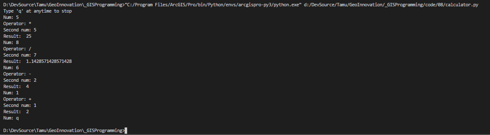

# TAMU GIS Programming
# Learning Objectives
- Learn how to create a basic, single-use calculator
- Create a slightly more useful, multi-use calculator
# The classic calculator
Now that we've gone over generating a Fibonacci sequence, we can take the skills utilized in that project to create a new one. We'll be creating a simple Python-based calculator with a simple 4 operation capability. If you've ever taken a programming course before you've probably had to create a calculator. This class will of course not be exempt from this time-honored tradition.
>
# Basic calculator
We can create a rather basic calculator quite easily with the knowledge we have already. All it takes is three variables, a few if statements, and a print line. That's it. Below is the full code required for a basic (albeit lame).
>
The code is surprisingly simple. We create three variables, one to hold our first number, our operator, and our second number. Take care to cast the **firstNum** and **secondNum** into numerical data types or we won't be able to do any math operations on them. With our numbers taken care of, we then need to calculate our result by running these numbers through some sort of operation. Using if statements we can reliably calculate the result. The if statements first check the **operator** variable's value. If it contains a '+', then we print the result of **firstNum** added to **secondNum**. If **operator** is not equal to '+', we then check if it is equal to '-'. If so, we subtract the **secondNum** from **firstNum** and print the result. We continue this for both '*' and '/' operations. We use an **else** statement at the end to check if we have something other than a basic mathematic operator as the value for **operator**. If so we go ahead and print a warning message to let the user know that they provided an invalid operator. And that's it!
>
```python
# Absolute basic calculator
numOne = int(input("First num: "))
operator = input("Operator: ")
numTwo = int(input("Second num: "))

if operator == '+':
    print("Result = ", (numOne + numTwo))
elif operator == '-':
    print("Result = ", (numOne - numTwo))
elif operator == '*':
    print("Result = ", (numOne * numTwo))
elif operator == '/':
    print("Result = ", (numOne / numTwo))
else:
    print("Invalid operator")
```
>
# Slightly more impressive calculator
With a simple calculator complete, we now move onto a slightly more advance calculator that allows us to continually operate our calculator until we press 'q'. Below is the full code for this advanced calculator. We define four different functions, one for each math operation. Using functions for this makes the code a little bit cleaner and easier to read. To get the script to continually run, we use a **while** loop that will continuously loop until we input a 'q' at any point. See how inside the while loop expression we are checking to see that **userInput** does not equal 'q'. When it is not equal to 'q', we proceed and do whatever is inside the loop. 
>
The first thing we need to do inside the loop is get three inputs from the user: the first number, the second number,and the math operator. We are reassigning the value of **userInput** to whatever the user inputs and then check to make sure that the value does not equal 'q'. If it does equal 'q', we use a special **break** statement to stop the while loop from proceeding further through the loop. This will make the while loop check once again if **userInput** equals 'q'. Since if the **break** was triggered **userInput** must equal 'q', the while loop will halt all execution and then the script will continue executing the remainder of the script. If the **userInput** does not equal 'q', we then create a new variable local to the while loop only **firstNum**. We then repeat this whole process again to get the **secondNum** and the math **operator**. 
>
Once we have our **firstNum**, **secondNum**, and **operator**, we can then pass these variables into our different functions to calculate the result. We use a series of conditional **if** statements to determine which function we will be using. Each **if** statement will look at the **operator** variable and see if it is equal to a different math operation. If the value of **operator** matches said value, we then proceed to run the function associated with it. This means if the **operator** value is equal to '+', we will pass **firstNum** and **secondNum** into our function **add()**. The function will add the two arguments and return the sum. We then use a print statement to print out the result of the **add()** function without assigning the result to a new variable. This results in a overall cleaner code.

>
```python
def add(x, y):
    return x + y

def subtract(x, y):
    return x - y

def multiply(x, y):
    return x * y

def divide(x, y):
    return x / y

print("Type \'q\' at anytime to stop")

userInput = ''
while userInput != 'q':
    userInput = input("Num: ")
    if userInput == 'q':
        break
    firstNum = int(userInput)
    
    userInput = input("Operator: ")
    if userInput == 'q':
        break
    operator = userInput

    userInput = input("Second num: ")
    if userInput =='q':
        break
    secondNum = int(userInput)

    if operator == '+':
        print("Result: ", add(firstNum, secondNum))
    elif operator == '-':
        print("Result: ", subtract(firstNum, secondNum))
    elif operator == '*':
        print("Result: ", multiply(firstNum, secondNum))
    elif operator == '/':
        print("Result: ", divide(firstNum, secondNum))
    else:
        print("Invalid operator provided")
        
```
>
>

# Iterator controls
## break
We can use the **break** statement to breakout of the innermost loop such as a for or while loop. Whenever Python encounters a **break**, it will stop following that current path and go back up a level. Our calculator above uses the **break** statement to stop execution of the while loop the moment the user inputs a "q". In the case of a for loop, like below, the **break** also keeps the for loop from progressing any further. It will add the first two numbers but when it encounters 3, the for loop stops executing and ignores the remaining values inside of our list **x**.
>
```python
x = [1, 2, 3, 4, 5]
total = 0
for num in x:
    if num == 3:
        break
    else:
        total += num

print(total) # Prints 3 since (1 + 2)
```
>
## continue
A **continue** is similar to a break in that it prevents the loop from executing, but a **continue** only stops the current iteration of the loop. This means in our example that instead of stopping and ignoring the remaining values inside of **x**, it will continue to add the values after it encounters the number 3.
>
```python
x = [1, 2, 3, 4, 5]
total = 0
for num in x:
    if num == 3:
        continue
    else:
        total += num

print(total) # Prints 12 since (1 + 2 + 4 + 5)
```
>
## pass
The **pass** statement does nothing. It is used when you need to have some code syntactically but do not want to provide any.
>
In the code examples sometimes you'll see something like this:
>
```python
class Truck:
    def __init__(self):
        pass

```
>
Python requires we have something inside our **\_\_init__()** as we cannot leave it empty. We can put the **pass** statement there to make Python and ourselves happy. We can then remove the **pass** and add real code to our **\_\_init__()** whenever we want.
# <span>calculator</span>.py
All of the Python code for creating a calculator can be found [here](../code/08/calculator.py).
# Additional resources
- http://www.openbookproject.net/books/bpp4awd/ch04.html#the-break-statement

## Lecture video - Calculator in Python
[Module2-Topic4](https://youtu.be/lA-PmqTeZDg)
