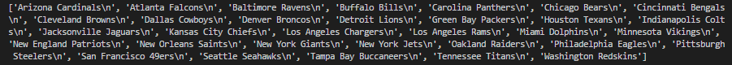

# TAMU GIS Programming
# Learning Objectives
- Learn how to open a text file
- Learn how to write to a text file
# Python Input / Output
When running a program on a computer or phone, the program is loaded into the systems RAM. RAM (or random access memory) is volatile, which means that when the program ends or the device is powered off the data currently in RAM will vanish. When dealing with important information we want to be able to use between sessions we use files. Files are just named blocks of data somewhere on a non-volatile storage medium, like a hard drive or SD card. 
>
When dealing with files in any programming language, we need to decide if we plan on just reading the contents of the file, or if we plan on modifying the contents in some way. If we tell Python we only wish to read the contents of a file, it will prevent us from making any sort of changes to said file. The converse is actually false though, when you open a file in write mode it actually allows you to both read and write.
>
## open() method 
We use the Python function **open()** to open up a file. It takes two parameters, the path and name of the file we wish to open and the open mode. Below you can find a short list of some of the different modes one can use when using **open()**.
>
```python
file = open("C:\path\to\file\name.txt", "r")
```
> ##### Example snippet of how to open a file in Python in read only mode
>
Parameter abbreviation | Mode | What it does
--- | --- | ---
r | Read mode | Allows you to read the contents of a file.
r+ | Read & write mode| Does *not* create a file if it doesn't exist.
w | Write mode | Allows you to read and modify the contents of a file.
w+ | Write mode | Same as w, but will create a file if it doesn't exist.
a | Append mode | Allows you to read and add to the contents of a file.
a+ | Append mode | Same as a, but will create a file if it doesn't exist.
>

>
The function **open()** returns to us a special data type we haven't covered yet known as a **file**. This **file** variable allows us to use several **file** specific functions (known as methods) that do file operations. We will be covering a few of these methods below but just know there are many more.
>
## read() and readlines() methods
The methods **read()** and **readlines()** are methods specific to Python **file** objects. Remember that **open()** returns one of these **file** objects. When we have a variable with a file in it, we can call these methods to read the content. The method **read()** reads the entire contents of the file into a string variable. This can be dangerous as the data is loaded into RAM; you may end up running out of free RAM if the file is large enough. Once we have a variable referencing the value returned by **read()** we can print out the contents of the file just by using a print statement and providing our variable.
>
We can also use the **readlines()** method to grab every line in the file. Unlike read() which returns a single string variable, **readlines()** puts each line into a list. This is useful if we wish to process a line of content from the file or if we are looking for something in particular.
>

>##### Result of printing **readlines()**
>
Below, I have a snippet of Python code that loads a text file named **nfl.txt** from my computer with the **r** mode. Python can be iffy when it comes to opening up files, so be sure to try putting the absolute path to a file if you get any issues. Also note the **r** before the path to my file, this is known as a **raw string** in Python. This special type of string allows us to freely use the backspace character without it trying to escape our characters such as "\n" for a new line. Another way to put it is the raw string means the string value is stored EXACTLY as it's written.
```python
file = open(r"D:\DevSource\Tamu\GeoInnovation\_GISProgramming\code\09\nfl.txt", "r")
nfl_teams = file.readlines()
for line in nfl_teams:
    print(line)
file.close()
```
>
You may come to a point when you will try to open a file that may or may not exist. You may want to wrap the entire operation inside a **try / except** block. This will gracefully handle any sort of errors we may get when trying to open or create a file without causing Python come to a grinding halt. When an error occurs inside the part indented below **try**, the code executes whatever is indented below **except** instead of crashing Python. 
>
```python
try:
    file = open('file.txt', 'r')
    data = file.read()
    file.close()
except IOError:
    print("An error has occurred")
```
>
## close() method
It is important when opening files in any programming language to make sure you close the file programmatically. We do this so we can make sure any unwritten data is properly handled before we close the connection to the file. This is not a requirement when *reading* a file, but is good practice to get used to calling the **close()** method whenever you are done with a file no matter what mode you used to open it.
>
## write() method
If you try and open a non-empty file with the **w** mode you will notice that the file will be wiped clean. Take care when using **w** mode; you may want to use the append mode (**a**) whenever adding to a file instead. You mainly want to use the **w** mode when creating a file from scratch. We can use the **open()** function just as we usually would, but instead we provide the name of the file we want to create, not of an existing file. We are then free to use the **write()** method of the file type. This method takes in a single parameter; a single string that will get put inside our file. We can use **write()** several times here without worrying about overriding the current contents. A **write()** example is found below:
>
```python
newFile = open('newFile.txt', 'w')
newFile.write("Hello world")
newFile.write("Hello world 2")
newFile.write("Hello world 3")
newFile.close()
```
>##### Prints the following to file newFile.txt:  `Hello worldHello world 2Hello world 3`
>
When we run this code, we end up with all of the contents on a single line rather than being three separate lines as one may think. We can fix this by simply putting in a **\n** at the end of each **write()**. This will add a new line to the string, effectively putting the contents of the next **write()** one line below the current.
>
```python
newFile = open('newFile.txt', 'w')
newFile.write("Hello world\n")
newFile.write("Hello world 2\n")
newFile.write("Hello world 3\n")
newFile.close()
```
>##### Prints the following to file newFile.txt: 
>##### Hello world
>##### Hello world
>##### Hello world

# Common errors
Below is a list of common errors and how to fix them
>
Error | Solution
--- | ---
`FileNotFoundError: [Errno 2] No such file or directory` | Python cannot find the file you're trying to open. Try using an absolute path to the file (i.e. C:\users\JohnDoe\Desktop\nfl.txt)
`PermissionError: [Errno 13] Permission denied` | You may be trying to open a directory instead of a file. Check the path you provided to method open().

# Additional resources
- http://www.pythonforbeginners.com/files/reading-and-writing-files-in-python
- https://www.guru99.com/reading-and-writing-files-in-python.html

## Videos
[Module3-Topic1](https://youtu.be/2VrWyNmZXbI)
