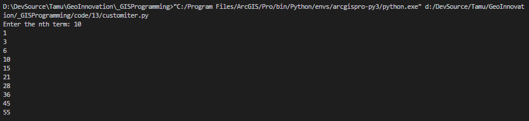

# TAMU GIS Programming
# Learning Objectives
- Go over basic iteration
- Detail advanced iteration
# Building an iterator
Any object we can loop through with a for loop is known as an **iterable objects**. 
>
We can create our own iterable objects by adding two special method to our class. The first method we need to incorporate is **\_\_iter__()**. When we use our object inside a for loop, it will look for the **\_\_iter__()** method before it will let us iterate through our object. Think of this method as a type of special constructor method that only gets called whenever we are about to iterate. Inside of **\_\_iter__()** we setup our object with any setup we may need to loop through, then we make sure to return our object using the **return** statement.
>
After **\_\_iter__()** is called, the for loop will continuously call **\_\_next__()**. This method has very two important parts: a special conditional that tells the for loop if we have need to stop the iteration process and the return statement. The conditional checks to make sure that we haven't reached a certain threshold to cancel our iteration. When that threshold is reached, we use **raise StopIteration**. This will trigger an error that the for loop will handle gracefully without crashing or exiting our script. Outside of our conditional we can do any sort of math we may need to then we return a value. That value is used as the local variable inside the for loop; you know the value that is always changing with every iteration of the loop.
>
Let's go ahead and create an iterator of our own: we'll be using ours to generate [triangular numbers](https://www.mathsisfun.com/algebra/sequences-series.html). 
>
```python
class TriangularNums:
    # Calculate triangular numbers with x = t(t+1)/2
    def __init__(self, n):
        self.n = n

    def __iter__(self):
        self.t = 1
        return self

    def __next__(self):
        if self.t > n:
            raise StopIteration

        x = self.t * (self.t + 1) / 2
        self.t += 1

        return int(x)
                               
n = int(input("Enter the nth term: "))
for x in TriangularNums(n):
    print(x)
```
>
The first part to create an iterator is to create a class, here we call it **TriangularNums** since it generates triangular numbers. We define our **\_\_init__()** method which takes in one additional argument: the nth number in the sequence. We'll use that number as our threshold to terminate the iteration. We set **n** as an instance variable and continue.
>
We then define our **\_\_iter__()** which sets up our object before we start the iteration. In this example we are creating an instance variable **t** which keeps track of how many times we've iterated through. Then we make sure we return our object in the return statement.
>
The last requirement is the **\_\_next__()** method. Here we define our threshold: the conditional that can stop our iteration. We check to make sure that **t** doesn't exceed **n**, if so we raise the **StopIteration** "error" and we stop iterating. After that we then generate our triangular number using **t**. Now that we have our triangular number, we make sure to increment **t** by one, if we forget this we may end up with an infinite loop. The last part is to return our triangular number **x**.
>
Now that our iterator class is finished, we can test it out. We grab an input from the user and cast it as a number **n**. We then create our for loop. We can set it up like any other, but instead of iterating through a list as we normally would, we put our iterator class after the **in**. Take care as to provide the user's input so that we can have a maximum index in the sequence to stop at. Inside the for loop we make sure print out the iteration value and we'll be greeted with our triangular numbers up to **n**!
>

>
# List comprehensions
**List comprehensions** are a quick and easy way to create lists from other lists, usually with some sort of mathematics applied. These **list comprehensions** look like for loops on steroids. Image you have a list of numbers that you need to transform in way, then store the resulting numbers in a separate list. Sure you could use a manual for loop or something to accomplish this task, but with the power of Python and list comprehensions, we can do this much quicker and much easier.
>
Image we have a list of numbers and we want to take every number, raise it to a power of 3, then put it in a different list. The example below accomplishes this with list comprehensions.
>
```python
numbers = [1, 2, 3, 4, 5, 6]
raisedNums = [x ** 3 for x in numbers] # List comprehension
print(raisedNums) # Prints [1, 8, 27, 64, 125, 216]
```
>
The example has a variable named **raisedNums** which contains our list comprehension statement. What this is doing is looping through the items inside our list **numbers**. It will loop through once for each number until it reaches the end. Each loop sets the variable **x** equal the next number in the list, starting at the 0th position which in this case is the number 1. The statement then applies the variable **x** to the rest of the comprehension, which for us, raises **x** to the third power. Once we have raised **x** to the power of three, we then append the value to the variable **raisedNums**. 
>
We can also use a conditional if statement to direct our list comprehension. The example below expands upon the first one by including an if statement. We use the if statement to check if **x** is an even number; if so we calculate **x** raised to the power of three then append the resulting number to **raisedNums**.
>
```python
numbers = [1, 2, 3, 4, 5, 6]
raisedNums = [x ** 3 for x in numbers if x % 2 == 0]
print(raisedNums) # Prints [1, 8, 27, 64, 125, 216]
```
>

## Videos
[Module4-Topic1](https://youtu.be/UTzBZfYR2I0)