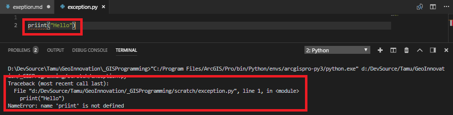
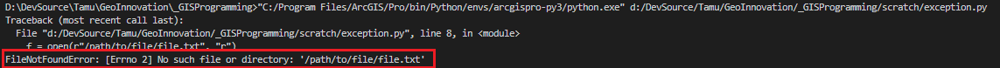

# TAMU GIS Programming
# Learning Objectives
- Detail the error handling practices in Python
# Dealing with errors
Errors are a problem every programmer deals with and it is up to them to figure out how to do so gracefully. We must not think of errors as indicators of catastrophic proportions as one may think. Instead, we should think of errors as common occurrences that we can deal with; most errors can be dealt with using code.
## Types of errors
There are two types of errors in Python: a **syntax** error and an **exception**. A **syntax** error is an error in the way you've written something. This could be as simple as putting one too many spaces in your Python code or even misspelling a function name. These types of errors are usually caught by your development environment; they will usually highlight a syntax error and tell you something is up with that snippet of code. An example of a syntax error is found below.
>

>
Here we have mistyped the built-in Python function print(). You can see that our text editor VSCode has underlined the word with a red squiggly line much like Word will do. If you hover your mouse pointer over this line, it will tell you the following:
>
`[pylint] E0602:Undefined variable 'priint'`
>
This message is equal to Python saying "Hey, I've noticed you're making a call to a function that doesn't exist. Maybe you should check that out? Perhaps you didn't spell something right?". Most syntax errors are relatively easy to fix; they usually only require you to look closely at your spelling.

The other kind of error you will encounter in Python is an **exception**. These are errors that arise whenever you are executing code and something happens that maybe shouldn't happen. Maybe a file isn't present or the user has defined an incorrect path in their input. These errors are the kind that will bring your script to a halt if not dealt with properly. 
>
```python
f = open(r"/path/to/file/file.txt", "r")
```
>
Imagine in the code snippet above that we try to run the code as is with this odd looking file path. Python will stop running as soon as it tries to open this "file". The error for this is shown below.
>

>
The best practice to take when dealing with errors is to *ALWAYS* read the error message. Error messages *generally* tell you what went wrong, not always but a good portion of times it can be quite obvious. Take the screen shot above, it clearly says `No such file or directory:` then it shows the path to the text file. One should then assume there is a problem with the path we've provided the **open()** function. 
# try / except
>
The most common way to do with a piece of code that may cause an error is to use what is known as a **try / except** statement. We can wrap a error-prone piece of code with this statement to gracefully handle any exceptions we may have.
>
```python
try:
    file = open(r"/path/to/file/file.txt", "r")
except FileNotFoundError:
    print("file not found")

try:
    otherFile = open(r"/path/to/other/file/otherfile.txt", "r")
except:
    print("file not found")

```
>
In the example above we try to run the same code as earlier, but now we have the protection of the **try / except** statement on our side! If the code within the **try** portion triggers an exception, the code will stop executing under the **try** statement and will start executing under the **except** statement. To the right of the except statement we can specify a specific exception like above or we can leave it alone. Both of the try / except blocks will handle any errors we may get trying to open this file. It may be best to leave the error will not be handled well if you specify an error that doesn't happen.
>
```python
try:
    file = open(r"/path/to/file/file.txt", "r")
except EOFError:
    print("file not found")

```
>
The code above specifically catches the **EOFError** which will trigger if we reach the end of a file. Since the file cannot be found, it can't possible reach the end of the file. When we run this code we actually get an error `FileNotFoundError: [Errno 2] No such file or directory: '/path/to/file/file.txt'`. We need to be careful to specify the exact error we may get when doing this or it will be as if we never used a try / except in the first place.
>
We can link several except statements together. This would be useful if you want to take a different route depending on the exception you actually raise. Below you can find an example of how to link several except statements.
>
```python
try:
    file = open(r"/path/to/file/file.txt", "r")
except EOFError:
    print("input / output error")
except FileNotFoundError:
    print("file not found error")
except:
    print("some other kind of error")
```
>
## finally
There is one more part we can append to a try / except statement block that can handle clean up we may need. The **finally** statement is used *after* the code inside the try or except has finished executing. Here we can do anything we want, but we will use our **finally** statement to handle our file closing code. The **finally** block executes *no matter what*. 
>
```python
file = None
try:
    file = open(r"/path/to/real/file/realFile.txt", "r")
except FileNotFoundError:
    print("file not found error")
except EOFError:
    print("input / output error")
except:
    print("some other kind of error")
finally:
    file.close()
    print("Closing file")
    
```
>


# Additional resources
- https://docs.python.org/3/tutorial/errors.html

## Videos
[Error handling](https://youtu.be/p4CSnU-f6bc)
