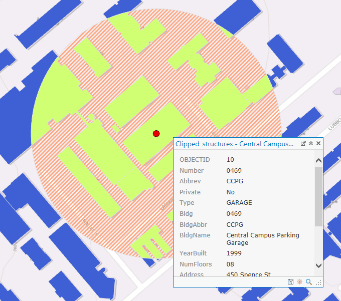
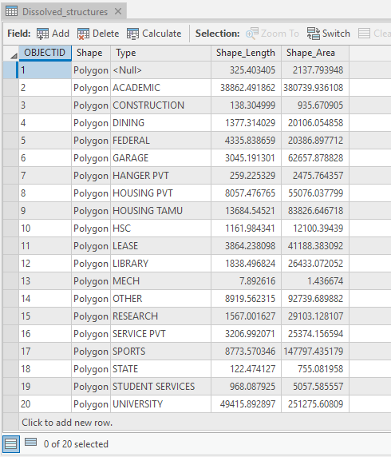
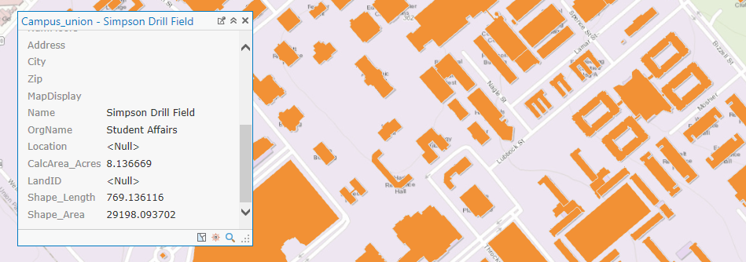
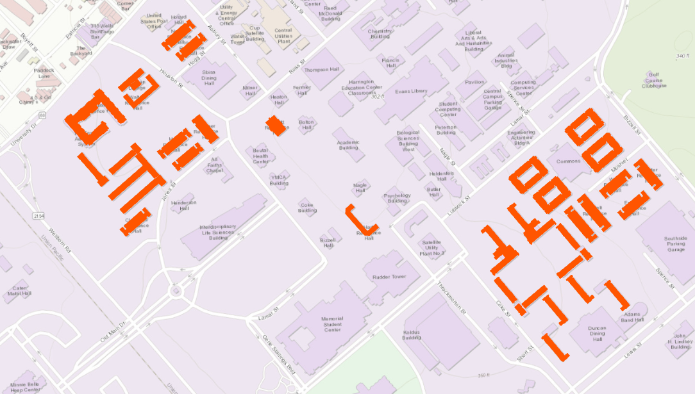

# TAMU GIS Programming
# Learning Objectives
- Detail how to...
    - Clip layers
    - Dissolve
    - Union layers
    - Extract data using Select
# Additional basic operations
This lecture will dive into more basic operations we can perform using the arcpy module. This is not an exhaustive list by any means, but a focused look into some of the more useful tools accessible with Python.
## Clip
The **clip** tool is used to "cut" a feature class with the geometry of another feature class, known as the clip feature. Though it sounds like the intersect tool, the clip tool only retains attributes from the input. This means that the resulting layer only contains attributes from the layer that is cut whereas the intersect tool combines attributes from both the input and the clip feature. 
>
In the example below, we are going to clip our campus structures feature class with the geographic area of the garage buffer feature class. This will result in a series of structures that fall within the garage buffer feature class. The resulting layer is populated with these structures usually "cut" across due to the nature of the clip tool.
>
```python
import arcpy
arcpy.env.workspace = "C:/tmp/ArcGISPython"
# Define our geodatabase
campus = r"D:/DevSource/Tamu/GeoInnovation/_GISProgramming/data/modules/17/Campus.gdb"
# Perform a clip
arcpy.Clip_analysis(campus + "/Structures", campus + "/GaragePoints_buffered", campus + "/Clipped_structures")
```
>
The first parameter for **Clip_analysis()** defines the input layer, the second defines our clip feature, while the third and final parameter defines the output layer.
>
>

>
## Dissolve
The **dissolve** tool is used to aggregate features in a feature class based on a specific attribute. In the example below we will dissolve the structures feature class through the **Type** field. This creates a feature class with one value for each **Type**, but each value contains several structures around campus whereas before there were multiple values for each building **Type**.
>
```python
import arcpy
arcpy.env.workspace = "C:/tmp/ArcGISPython"
# Define our geodatabase
campus = r"D:/DevSource/Tamu/GeoInnovation/_GISProgramming/data/modules/17/Campus.gdb"= 
# Dissolve the layer
arcpy.Dissolve_management(campus + "/Structures", campus + "/Dissolved_structures", "Type")
```
>
For **Dissolve_management()**, the first parameter we define is the input layer, the second defines the resulting layer, and the third parameter defines which field in the input we want to dissolve our feature class with.
>

>
## Union
The **union** tool is used to combine attributes and features of two feature classes into a new feature class. The resulting feature class will contain the attributes from both feature classes unless otherwise specified. This tool only works with polygons.
>
```python
import arcpy
arcpy.env.workspace = "C:/tmp/ArcGISPython"
# Define our geodatabase
campus = r"D:/DevSource/Tamu/GeoInnovation/_GISProgramming/data/modules/17/Campus.gdb"
# Define our layers
structures = campus + "/Structures"
landuse = campus + "/LandUse"
# Perform a union of two layers
arcpy.Union_analysis([structures, landuse], campus + "/Campus_union", "NO_FID")
```
>
**Union_analysis()** takes in three parameters: the first is a list that defines all the input layers. The second parameter is the resulting layer created with the union. The third parameter defines how the union will operate. Here we are limiting the union in a way as to not combine FIDs of the input layers into the result layer.
>

>
## Select
The **select** tool is used to extract features from a feature class using an SQL expression. Once the select tool has finished running, the resulting layer contains whichever features satisfied the defined **where clause**.
>
```python
import arcpy
arcpy.env.workspace = "C:/tmp/ArcGISPython"
# Define our geodatabase
campus = r"D:/DevSource/Tamu/GeoInnovation/_GISProgramming/data/modules/17/Campus.gdb"
# Define our where clause
where = '"Type" = \'HOUSING TAMU\''
# Perform a select
arcpy.Select_analysis(campus + "/Structures", campus + "/housing", where)
```
>
**Select_analysis()** requires three parameters. The first parameter defines the input feature class. The second defines the resulting feature class. The final parameter is our **where clause**. A where clause is an SQL statement that limits the results of a query to only those features that satisfy the clause. In our where clause we are asking for those features within the input that are of Type "HOUSING TAMU". This means our resulting feature class only contains those features that are campus housing.
>

>
# Additional resources
- http://pro.arcgis.com/en/pro-app/tool-reference/analysis/clip.htm
- http://pro.arcgis.com/en/pro-app/tool-reference/data-management/dissolve.htm
- http://pro.arcgis.com/en/pro-app/tool-reference/analysis/union.htm
- http://pro.arcgis.com/en/pro-app/tool-reference/analysis/select.htm

## Videos
[Module5-Topic1](https://youtu.be/lgrm2RLdVSs)