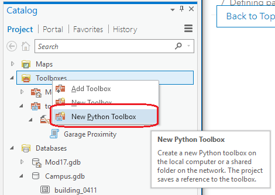
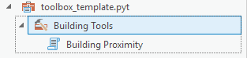
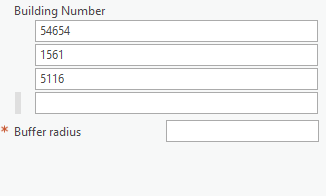
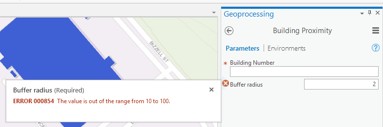

# TAMU GIS Programming
# Learning Objectives
- Create a Python toolbox with our tool
# Python toolbox
A Python toolbox is simply a single text file that acts as the *glue* that groups several individual tools under a single group name. In order to create a new toolbox, we can use the **Toolboxes** sub pane of the **Catalog** pane on ArcGIS Pro. Right click on **Toolboxes** and select **New Python Toolbox**. Then select where you want to save your toolbox; I recommend to place it in your workspace or somewhere you won't forget.
>

>
This creates a **.pyt** file with a bunch of default code inside. This is our toolbox file. But at the moment it is lacking everything we need to be useful. The steps below will show you how to go about adding in the tool we made in the previous lecture.
>
# Adding our tool
Below is what the plain toolbox **.pyt** file looks like. 
>
```python
import arcpy

class Toolbox(object):
    def __init__(self):
        """Define the toolbox (the name of the toolbox is the name of the
        .pyt file)."""
        self.label = "Toolbox"
        self.alias = ""

        # List of tool classes associated with this toolbox
        self.tools = [Tool]


class Tool(object):
    def __init__(self):
        """Define the tool (tool name is the name of the class)."""
        self.label = "Tool"
        self.description = ""
        self.canRunInBackground = False

    def getParameterInfo(self):
        """Define parameter definitions"""
        params = None
        return params

    def isLicensed(self):
        """Set whether tool is licensed to execute."""
        return True

    def updateParameters(self, parameters):
        """Modify the values and properties of parameters before internal
        validation is performed.  This method is called whenever a parameter
        has been changed."""
        return

    def updateMessages(self, parameters):
        """Modify the messages created by internal validation for each tool
        parameter.  This method is called after internal validation."""
        return

    def execute(self, parameters, messages):
        """The source code of the tool."""
        return
```
>
You can see that it is comprised of two classes: a class that defines the overall **Toolbox**, and a class that defines a **Tool**. It is important to remember that we can **NOT** change the Toolbox class name, but we *can* change the Tool class name to reflect our tool. If we were to change class **Toolbox** to something else like **OurToolbox**, ArcGIS will freak out. 
>
The **Toolbox** class has three instance attributes: label, alias, and tools. The attribute we are most interested in is tools. This attribute lists the class name of all tools found inside our toolbox. At the moment it contains one class; the Tool class that was created whenever we initialized a new toolbox. Let us change the value of that list attribute to include **BuildingProximity** instead. While we are at it, let's go ahead and rename the **Tool** class to **BuildingProximity** as well.
>
```python
# self.tools = [Tool] OLD CLASS
self.tools = [BuildingProximity]

class BuildingProximity(object):
    ...
```
>
If we wanted to add multiple tools to our tool box, we would simply copy the default Tool class and edit it accordingly. As long as you make sure to add the new tool classes into the Toolbox's **self.tools** attribute you should be able to add as many tools as you would like.
>
# BuildingProximity
All tools you make for ArcGIS Pro will follow a similar structure to the one above. There are at least two methods you need to include in your class in order for your tool to work properly. Below we will dive into all of the methods used in a tool class; some are required for all tools while other's are merely optional.
## \_\_init__ (required)
The **\_\_init__()** method is one of the required tool methods. Without it your tool will not work. Within this method you can define several attributes that describe your tool such as the tool label, tool description, and tool category. The **label** attribute is the display name of the tool within the toolbox, while the **description** attribute describes the function of the tool. 
>
```python
def __init__(self):
    """Define the tool (tool name is the name of the class)."""
    self.label = "Building Proximity"
    self.description = "Determines which buildings on TAMU's campus are near a targeted building"
    self.canRunInBackground = False # Only used in ArcMap
    self.category = "Building Tools"
```
>
The **category** attribute is a way to group different tools within our toolbox: 
>

>
## getParameterInfo (optional)
The **getParameterInfo()** method is optional only if you do not need to use any user provided inputs. Within this method we define what parameters our tool requires from the user. Each parameter is an instance of a **Parameter** object. Some of the properties you will need to set within a param object are shown below.
>
```python
def getParameterInfo(self):
    """Define parameter definitions"""
    param0 = arcpy.Parameter(
        displayName="Building Number",
        name="buildingNumber",
        datatype="GPString",
        parameterType="Required",
        direction="Input"
    )
    param1 = arcpy.Parameter(
        displayName="Buffer radius",
        name="bufferRadius",
        datatype="GPDouble",
        parameterType="Required",
        direction="Input"
    )
    params = [param0, param1]
    return params
```
>
It is important when setting up your parameter objects to set the correct **datatype** attribute and whether or not it is a required parameter. If your tool works as a stand-alone script but fails whenever you add it into a toolbox, you may need to double check your defined **datatype**. The full list of parameter types is located on the [Esri Parameter Data Types Page](http://pro.arcgis.com/en/pro-app/arcpy/geoprocessing_and_python/defining-parameter-data-types-in-a-python-toolbox.htm).
>
## isLicensed (optional)
The **isLicensed()** method is used to check for any extensions your tool may need and if the user has an appropriate license for said extension. Since this is an optional method and our building proximity tool does not rely upon license-locked functionality, we do not need to worry about this method.
>
```python
# Code is ESRI's own example found here: http://pro.arcgis.com/en/pro-app/arcpy/geoprocessing_and_python/controlling-license-behavior-in-a-python-toolbox.htm
def isLicensed(self):
    """Allow the tool to execute, only if the ArcGIS 3D Analyst extension 
    is available."""
    try:
        if arcpy.CheckExtension("3D") != "Available":
            raise Exception
    except Exception:
        return False  # tool cannot be executed

    return True  # tool can be executed
```
>
If your tool relied upon tools requiring a license to use such as any tools under 3D analyst, you would check in this method to make sure the user has access to 3D analyst tools.
## updateParameters (optional)
The next method, **updateParameters()** is yet another optional method, though if you want to make a robust and stable tool you may want to utilize this method. The **updateParameters()** method is used to update input parameters before ArcGIS's internal validation step runs. This method is useful if you need to process the user's input in some way before using them.
>
```python
# Code is ESRI's own example found here: http://pro.arcgis.com/en/pro-app/arcpy/geoprocessing_and_python/customizing-tool-behavior-in-a-python-toolbox.htm
def updateParameters(self, parameters):
    # Set the default distance threshold to 1/100 of the larger of the width
    #  or height of the extent of the input features.  Do not set if there is no 
    #  input dataset yet, or the user has set a specific distance (Altered is true).
    #
    if parameters[0].valueAsText:
        if not parameters[6].altered:
            extent = arcpy.Describe(parameters[0]).extent
        if extent.width > extent.height:
            parameters[6].value = extent.width / 100
        else:
            parameters[6].value = extent.height / 100

    return
```
>
## updateMessages (optional)
The **updateMessages()** method is called after ArcGIS's internal validator has finished running. Within this method you can modify any of the messages created from the validator and change them as you see fit. This is useful for creating custom error messages regarding your inputs.
>
## execute (required)
After \_\_init__(), **execute()** is the most important method you will deal with when creating a tool. Within this method goes all the code and logic behind our building proximity tool. While we can copy and paste our tool code from the previous lecture into this method, we must be careful to change where the user input comes from. This method has a **parameters** argument that contains all the parameters we set up within the **getParameterInfo()** method. We need to update our code to make sure that all the user arguments our code needs to run comes from here, not from **input()** as we were doing before when we were getting data directly from the user typing into into the console window. Since **parameters** is a list we access the values within with square brackets and give the index of the data we want. Within **getParameterInfo()**, we created two parameter objects and put them in a list variable. Our building number is contained within **param0** and our buffer radius is **param1**. To access our building number, we would access the first location within the **parameters** argument; while we would use the second location within **parameters** to access the buffer radius.
>
```python
 def execute(self, parameters, messages):
        """The source code of the tool."""
        campus = r"D:/DevSource/Tamu/GeoInnovation/_GISProgramming/data/modules/17/Campus.gdb"

        # Setup our user input variables
        buildingNumber_input = parameters[0].valueAsText
        bufferSize_input = int(parameters[1].value)

        # Generate our where_clause
        where_clause = "Bldg = '%s'" % buildingNumber_input

        # Check if building exists
        structures = campus + "/Structures"
        cursor = arcpy.SearchCursor(structures, where_clause=where_clause)
        shouldProceed = False

        for row in cursor:
            if row.getValue("Bldg") == buildingNumber_input:
                shouldProceed = True

        # If we shouldProceed do so
        if shouldProceed:
            # Generate the name for our generated buffer layer
            buildingBuff = "/building_%s_buffed_%s" % (buildingNumber_input, bufferSize_input)
            # Get reference to building
            buildingFeature = arcpy.Select_analysis(structures, campus + "/building_%s" % (buildingNumber_input), where_clause)
            # Buffer the selected building
            arcpy.Buffer_analysis(buildingFeature, campus + buildingBuff, bufferSize_input)
            # Clip the structures to our buffered feature
            arcpy.Clip_analysis(structures, campus + buildingBuff, campus + "/clip_%s" % (buildingNumber_input))
            # Remove the feature class we just created
            arcpy.Delete_management(campus + "/building_%s" % (buildingNumber_input))
        else:
            print("Seems we couldn't find the building you entered")
        return None
```
>
And that's it! Your very own Python-based ArcGIS tool and toolbox.
# Types of parameter inputs
Our tool only uses two inputs that require a single value each. Sometimes you may want to make your inputs contain a list of values such as many feature classes or many different bin values. Below we will explain these a little further and how to use them.
## Multivalue
The **multiValue** attribute of a parameter object found in **getParameterInfo()** can be used to handle multiple values whereas a non-multiValue can only handle one value at a time.
>
```python
def getParameterInfo(self):
    param0 = arcpy.Parameter(
        displayName="Building Number",
        name="buildingNumber",
        datatype="GPString",
        parameterType="Required",
        direction="Input",
        multiValue=True
    )
```
>

<!-- ## Value table
Sometimes you will want the user to specify multiple values for a tool such as several layers to intersect or dissolve. You can also use a **value table** parameter to   -->
# Filters
Filters are used to limit the type of data user's will provide an input. Say you have a tool that requires a number for an input; with filters you can limit the type of data you will take for an input to prevent a user from putting in a string or feature class. A filter can provide a list of acceptable values for an input, a range of values, or even specify which geometry types your input will take. Additionally, filters can be used to limit an input's value to a set range like in the example below.
>
```python
def getParameterInfo(self):
    param1 = arcpy.Parameter(
        displayName="Buffer radius",
        name="bufferRadius",
        datatype="GPDouble",
        parameterType="Required",
        direction="Input"
    )
    param1.filter.type = "Range"
    param1.filter.list = [10, 100]
```
>
>

>

# Additional resources
- http://pro.arcgis.com/en/pro-app/arcpy/geoprocessing_and_python/a-template-for-python-toolboxes.htm
- http://pro.arcgis.com/en/pro-app/arcpy/geoprocessing_and_python/defining-parameter-data-types-in-a-python-toolbox.htm

## Videos
[Module5-Topic3](https://youtu.be/RPaPa0Mj8JA)