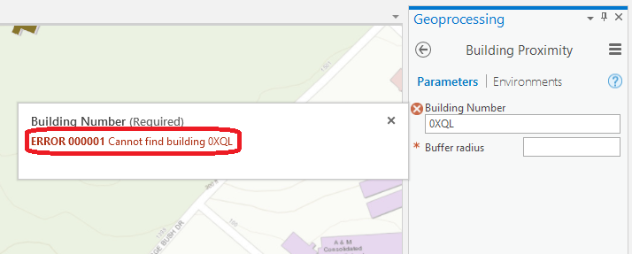
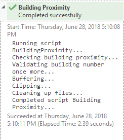
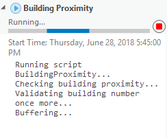
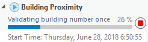

# TAMU GIS Programming
# Learning Objectives
- Produce and present appropriate tool messages to a user
- Produce and present appropriate tool progress to a user
# Arcpy tool messaging
Back when we were covering how to create and add a tool into a toolbox we mentioned a method inside the tool called **updateMessages()**. We glanced over the subject at the time as it wasn't too important in the actual creation of the toolbox, in fact it isn't even a required method like execute or \_\_init__. Though its a completely optional tool method, we will now be going over why you should be utilizing **updateMessages()** and how to go about using it.
>
Have you written a Python script yet or any program for that matter and been presented with an error message that left you scratching your head? You know those errors that say `ERROR 999999: An exception has occurred` and you think to yourself "Thanks for the heads up, now what is actually wrong"; those are always fun. When you make a tool you don't want to be a part of that problem; you don't want to be the person associated with those types of errors. Below we'll dive into how to create meaningful error messages from your toolbox.
>
# The toolbox 
For this lecture we will be adding a new input to the toolbox we created previously for seeing which buildings were near a particular building. We want to be able to display a message to inform the user if they try to buffer a building that does not exist inside the campus **Structures** feature class.
>
Below you will find all the code needed for the toolbox from the previous lecture.
>
```python
import arcpy


class Toolbox(object):
    def __init__(self):
        """Define the toolbox (the name of the toolbox is the name of the
        .pyt file)."""
        self.label = "GEOG676_Tools"
        self.alias = "GEOG676_Tools"

        # List of tool classes associated with this toolbox
        self.tools = [BuildingProximity]


class BuildingProximity(object):
    def __init__(self):
        """Define the tool (tool name is the name of the class)."""
        self.label = "Building Proximity"
        self.description = "Determines which buildings on TAMU's campus are near a targeted building"
        self.canRunInBackground = False # Only used in ArcMap
        self.category = "Building Tools"

    def getParameterInfo(self):
        """Define parameter definitions"""
        param0 = arcpy.Parameter(
            displayName="Building Number",
            name="buildingNumber",
            datatype="GPString",
            parameterType="Required",
            direction="Input"
        )
        param1 = arcpy.Parameter(
            displayName="Buffer radius",
            name="bufferRadius",
            datatype="GPDouble",
            parameterType="Required",
            direction="Input"
        )
        param1.filter.type = "Range"
        param1.filter.list = [10, 100]
        params = [param0, param1]
        return params

    def isLicensed(self):
        """Set whether tool is licensed to execute."""
        return True

    def updateParameters(self, parameters):
        """Modify the values and properties of parameters before internal
        validation is performed.  This method is called whenever a parameter
        has been changed."""
        return

    def updateMessages(self, parameters):
        """Modify the messages created by internal validation for each tool
        parameter.  This method is called after internal validation."""
        return

    def execute(self, parameters, messages):
        """The source code of the tool."""
        campus = r"D:/DevSource/Tamu/GeoInnovation/_GISProgramming/data/modules/17/Campus.gdb"

        # Setup our user input variables
        buildingNumber_input = parameters[0].valueAsText
        bufferSize_input = int(parameters[1].value)

        # Generate our where_clause
        where_clause = "Bldg = '%s'" % buildingNumber_input

        # Check if building exists
        structures = campus + "/Structures"
        cursor = arcpy.SearchCursor(structures, where_clause=where_clause)
        shouldProceed = False

        for row in cursor:
            if row.getValue("Bldg") == buildingNumber_input:
                shouldProceed = True

        # If we shouldProceed do so
        if shouldProceed:
            # Generate the name for our generated buffer layer
            buildingBuff = "/building_%s_buffed_%s" % (buildingNumber_input, bufferSize_input)
            # Get reference to building
            buildingFeature = arcpy.Select_analysis(structures, campus + "/building_%s" % (buildingNumber_input), where_clause)
            # Buffer the selected building
            arcpy.Buffer_analysis(buildingFeature, campus + buildingBuff, bufferSize_input)
            # Clip the structures to our buffered feature
            arcpy.Clip_analysis(structures, campus + buildingBuff, campus + "/clip_%s" % (buildingNumber_input))
            # Remove the feature class we just created
            arcpy.Delete_management(campus + "/building_%s" % (buildingNumber_input))
        else:
            print("Seems we couldn't find the building you entered")
        return None

```
>
## Adding in an error message
The function we'll be adding code to is the **updateMessages()** method inside our **BuildingProximity** class.
>
```python
def updateMessages(self, parameters):
    """Modify the messages created by internal validation for each tool
    parameter.  This method is called after internal validation."""
    return
```
>
As you can see from the method declaration, we have two arguments: self and **parameters**. Remember from the toolbox lecture that the **parameters** argument passed in here are the parameters we defined back in the **getParameterInfo()** method. Let us go ahead and loop through the parameters so we can find the parameter with a name of **buildingNumber**. This is the name we gave the parameter that holds our building number input.
>
```python
def updateMessages(self, parameters):
    for param in parameters:
        if param.name == "buildingNumber":
            # We've found the correct parameter
            buildingNum = param.value
    return
```
>
With our parameter found, we now need to see if the value provided exists inside the **Structures** layer. In order to do so we need to use a **SearchCursor** and count how many results we get back. We need to redefine our **campus** and **where_clause** variables so we can access the data layers. We then create a **cursor** variable that contains the results of the **SearchCursor**.
>
```python
def updateMessages(self, parameters):
    for param in parameters:
        if param.name == "buildingNumber":
            buildingNum = param.value
            campus = r"D:/DevSource/Tamu/GeoInnovation/_GISProgramming/data/modules/24/Campus.gdb"
            where_clause = "Bldg = '%s'" % buildingNum
            cursor = arcpy.SearchCursor(campus + "/Structures", where_clause=where_clause)
    return
```
>
Now that we have our results, how do we tell how many rows we have in the cursor? For whatever reason, arcpy does not provide a simple way to determine how many rows are in a cursor and you cannot use **len()** on cursors either. The simplest way would be to iterate through a for loop and count how many times the for loop executes. It's not the most efficient or the nicest way, but it works. Then we simply check to see if the **count** is greater than 0; if it is, we know we have that building in the feature class **Structures**. Let's add all this in now.
```python
def updateMessages(self, parameters):
    for param in parameters:
        if param.name == "buildingNumber":
            buildingNum = param.value
            campus = r"D:/DevSource/Tamu/GeoInnovation/_GISProgramming/data/modules/24/Campus.gdb"
            where_clause = "Bldg = '%s'" % buildingNum
            cursor = arcpy.SearchCursor(campus + "/Structures", where_clause=where_clause)
            count = 0
            for row in cursor:
                count += 1
            if count == 0:
                param.setErrorMessage("Cannot find building %s in Structures" % buildingNum)
    return
```
>
We are not interested in how many rows are returned, we only care if there are no rows returned by the **SearchCursor()**. If no rows are found, we know that the building is not in the **Structures** feature class and we write out a message. To do so we use the **setErrorMessage()** method on the parameter. We simply give it an error message and test it out!
>

>
In addition to telling us an error has occurred, we can also use the following line to output messages to the **Results**. 
>
```python
arcpy.AddMessage("Buffering...")
```
>
When placed inside the tool method **execute()**, this will print out a message that looks like the following:
>

>
# Adding a progressor
Another element you can add to a tool to improve the overall experience is to add in a **progressor**. What is a progressor? A progressor is the little bar that lets you know the tool is currently working on something. There are two types of progressor: default and step. The default progressor displays a moving bar that constantly moves back and forth. This is good to use when we do not know how long something will take or if the operation takes a while. Step is the progressor type we will create below. With step we can advance the progressor in increments after a specific piece of code has executed.
>

>
Adding in one of these is fairly simple as all we need to do is set it and periodically change the position and label. Let's go ahead and add a progressor into our tool.
>
Inside of the **execute()** method, go ahead and define the following variables:
>
```python
    readTime = 1.5
    start = 0
    maximum = 100
    step = 25
```
>
**readTime** is used to delay the progressor titles by a small margin so that the user can actually read them without the text flashing away. The variable **start** defines the beginning position of our progressor, **maximum** defines the absolute maximum value, and **step** is used to move the progressor along. 
>
Once our variables are defined we can setup the progressor and advance it after key portions of our tool have finished executing. Setting up a progressor involves calling **arcpy.SetProgressor()** and providing in five parameters: the type of progressor, the progressor label, the start value, the end value, and a step value.
>
```python
# Setting up the progressor
arcpy.SetProgressor("step", "Checking building proximity...", start, maximum, step)
```
>
Once set up, we can then use the following method code to advance the progressor:
>
```python
arcpy.SetProgressorPosition(start + step)
arcpy.SetProgressorLabel("Validating building number once more...")
time.sleep(readTime)
```
>
The method **SetProgressorPosition** changes the "percentage" completed of the progressor while **SetProgressorLabel** changes the message displayed alongside the progressor. The last line involves importing the **time** module; we fix this with **import time** just below **import arcpy**. When we call **time.sleep(readTime)** we are momentarily halting the execution of our tool. This is used just so we can see the progressor labels changing.
>

>
# execute()
Below you will find the entire **execute()** method of our newly improved tool.
>
```python
    def execute(self, parameters, messages):
        """The source code of the tool."""
        # Define our progressor variables
        readTime = 2.5
        start = 0
        maximum = 100
        step = 25

        # Setup the progressor
        arcpy.SetProgressor("step", "Checking building proximity...", start, maximum, step)
        time.sleep(readTime)
        # Add message to the results pane
        arcpy.AddMessage("Checking building proximity...")

        campus = r"D:/DevSource/Tamu/GeoInnovation/_GISProgramming/data/modules/17/Campus.gdb"
        
        # Setup our user input variables
        buildingNumber_input = parameters[0].valueAsText
        bufferSize_input = int(parameters[1].value)

        # Generate our where_clause
        where_clause = "Bldg = '%s'" % buildingNumber_input

        # Check if building exists
        structures = campus + "/Structures"
        cursor = arcpy.SearchCursor(structures, where_clause=where_clause)
        shouldProceed = False

        # Increment the progressor and change the label; add message to the results pane
        arcpy.SetProgressorPosition(start + step)
        arcpy.SetProgressorLabel("Validating building number once more...")
        time.sleep(readTime)
        arcpy.AddMessage("Validating building number once more...")

        for row in cursor:
            if row.getValue("Bldg") == buildingNumber_input:
                shouldProceed = True


        # If we shouldProceed do so
        if shouldProceed:
            # Generate the name for our generated buffer layer
            buildingBuff = "/building_%s_buffed_%s" % (buildingNumber_input, bufferSize_input)
            # Get reference to building
            buildingFeature = arcpy.Select_analysis(structures, campus + "/building_%s" % (buildingNumber_input), where_clause)
            # Buffer the selected building
            arcpy.Buffer_analysis(buildingFeature, campus + buildingBuff, bufferSize_input)
            # Increment the progressor, change label, output message to results pane too
            arcpy.SetProgressorPosition(start + step)
            arcpy.SetProgressorLabel("Buffering....")
            time.sleep(readTime)
            arcpy.AddMessage("Buffering...")
            # Clip the structures to our buffered feature
            arcpy.Clip_analysis(structures, campus + buildingBuff, campus + "/clip_%s" % (buildingNumber_input))
            # Increment the progressor, change label, output message to results pane too
            arcpy.SetProgressorPosition(start + step)
            arcpy.SetProgressorLabel("Clipping....")
            time.sleep(readTime)
            arcpy.AddMessage("Clipping...")
            # Remove the feature class we just created
            arcpy.Delete_management(campus + "/building_%s" % (buildingNumber_input))
            # Increment the progressor, change label, output message to results pane too
            arcpy.SetProgressorPosition(maximum)
            arcpy.SetProgressorLabel("Cleaning up files....")
            time.sleep(readTime)
            arcpy.AddMessage("Cleaning up files...")
        else:
            print("Seems we couldn't find the building you entered")
        return None
```
>
# Additional resources
- http://pro.arcgis.com/en/pro-app/arcpy/geoprocessing_and_python/writing-messages-in-script-tools.htm
- http://pro.arcgis.com/en/pro-app/arcpy/geoprocessing_and_python/controlling-the-progress-dialog-box.htm#GUID-BC06043D-A7D7-49A5-A341-D72C54A01AFD
- http://pro.arcgis.com/en/pro-app/arcpy/geoprocessing_and_python/understanding-the-progress-dialog-in-script-tools.htm

## Videos
[Module6-Topic4](https://youtu.be/4W3EfVYLfRo)