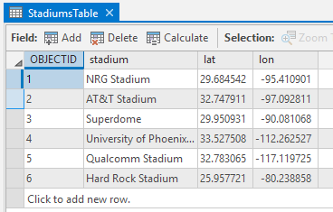
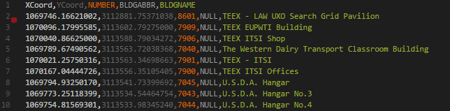
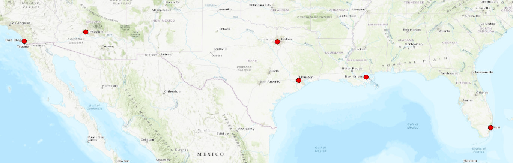
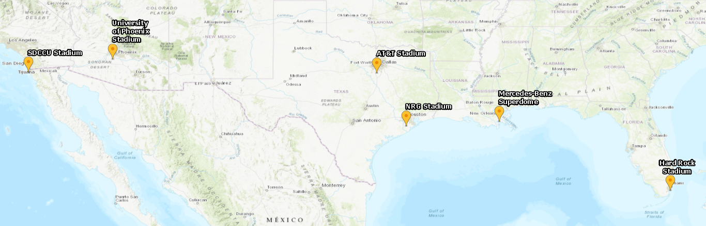
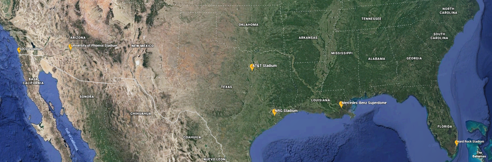
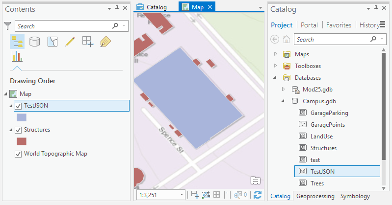
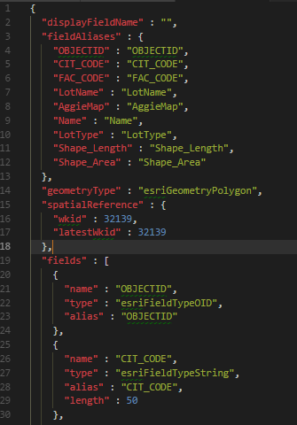
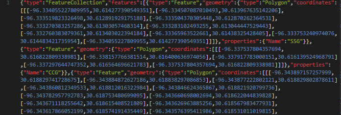

# TAMU GIS Programming
# Learning Objectives
- Convert to and from common geographic data formats
# Arcpy data format conversions
Being able to work with any data format that you can find (or are given) is an important skill. Known lovingly as **Data Wrangling**, this will unfortunately be one of the main tasks that you find yourself doing. 
Despite your expert opinion, you will find that one or more of the following continue to plague you throughout your career as a GIS programmer:
- Your colleagues still keep asking you for KML layers so they can show their data using Google Earth in a presentation
- The only data you can find for a task you need is in GeoJSON or KML format
- Someone's kid told them about the MapBox mobile API, and now you have to make  GeoJSON data layers to be shown in the app
- You need to pull data from an ArcServer with code, and it only exports Esri JSON 
>
# CSV
Comma separated values (or .csv) are a way to store data in a human readable structure. These files usually have a header row that occupies the first position in the file. This will tell the user which column of data corresponds to a certain data field. In the example below you will find a sample .csv that contains four fields: user, email, state, and country. Each row after the header represents a single instance of data. The row can be split by the comma to represent each value for a particular field (e.g. Bill being a user, Texas is the state he resides in, etc). It is important to note that for .csv's order does matter.
>
```csv
User,Email,State,Country
Bill,bill@aol.com,Texas,United States
Jim,jim@yahoo.com,Oklahoma,United States
```
>
## CSV to GDB
The following example will take you through importing a standard comma separated value file into a geodatabase. The .csv used for this example can be found [here](../code/25/stadiums.csv). We create two variables, one that references our .csv file while the other references the desired output geodatabase. We then use **arcpy.management.MakeXYEventLayer()** to do the conversion. We pass in the .csv, tell the method where the coordinate fields are, then the output location.
>
```python
    import arcpy
    stadiums = r"D:/DevSource/Tamu/GeoInnovation/_GISProgramming/code/25/stadiums.csv"
    campus = r"D:/DevSource/Tamu/GeoInnovation/_GISProgramming/data/modules/25/Campus.gdb"
    arcpy.management.MakeXYEventLayer(stadiums, "lon", "lat", campus + "/Stadiums")    
```
>

>
## GDB to CSV
The following example will walk you through creating a .csv from a feature class found inside of a geodatabase. We create a reference to our geodatabase as well as the feature layer inside the geodatabase we want to convert. Using **arcpy.da.SearchCursor()** we can get all features in the feature class. Once we have our features, we create a new blank comma separated file; then simply write out the contents using the **write()** method.
>
```python
    import arcpy
    campus = r"D:/DevSource/Tamu/GeoInnovation/_GISProgramming/data/modules/25/Campus.gdb"
    garages = campus + "/GaragePoints"
    garageFile = r"D:/DevSource/Tamu/GeoInnovation/_GISProgramming/code/25/garagesFromGdb.csv"
    search = arcpy.da.SearchCursor(garages, field_names=["Name", "SHAPE@XY"])
    file = open(garageFile, "w")
    file.write("GarageName,lon,lat\n")
    for row in search:
        print(row)
        file.write("%s,%s,%s\n" % (row[0], row[1][0], row[1][1])) 
```
>

>
## CSV to Table
This example goes over how to turn a .csv into a simple table in a geodatabase. We create a reference to both the input .csv as well as a reference to the output geodatabase. Then simply call **arcpy.TableToTable_conversion()**, provide the input, output location, and output name.
>
```python
    import arcpy
    stadiums = r"D:/DevSource/Tamu/GeoInnovation/_GISProgramming/code/25/stadiums.csv"
    campus = r"D:/DevSource/Tamu/GeoInnovation/_GISProgramming/data/modules/25/Campus.gdb"
    arcpy.TableToTable_conversion(stadiums, campus, "StadiumsTable")
```
>

>
## GDB to CSV (easy)
The last .csv example goes over how to easily turn a feature class in a geodatabase into a .csv without all the fuss of the first example. All we need to do is create two variables that hold references to our output file name and input feature. Then use **arcpy.stats.ExportXYv()** providing in the input feature, the fields you want included, the delimiter, the output location, and if you wish to include field names as a header.
>
```python
    import arcpy
    campus = r"D:/DevSource/Tamu/GeoInnovation/_GISProgramming/data/modules/25/Campus.gdb"
    export_fields = [Number;BldgAbbr;BldgName]
    output_location = r"D:/DevSource/Tamu/GeoInnovation/_GISProgramming/code/25/Structures.csv"
    arcpy.stats.ExportXYv(campus + "/Structures", export_fields, "COMMA", output_location, "ADD_FIELD_NAMES")
```
>

>
# KML
Key-hole markup language, otherwise known as KML, is a way of structuring data based off of markup language making KML similar to XML and HTML. Data are stored by tags that define the type of data contained within. An example KML document for a single point is found below.
>
```xml
<kml xmlns="http://www.opengis.net/kml/2.2">
  <Placemark>
    <name>Simple placemark</name>
    <description>Attached to the ground. Intelligently places itself 
       at the height of the underlying terrain.</description>
    <Point>
      <coordinates>-122.0822035425683,37.42228990140251,0</coordinates>
    </Point>
  </Placemark>
</kml>
```
>
## KML to layer
In order to convert a single KML file to a layer file, we must first import the arcpy module. Once that is complete, we can use the arcpy **KMLToLayer_conversion()** method. Simply use the .kml as the first parameter and the output location as the second parameter. 
>
```python
    import arcpy
    stadiums = r"D:/DevSource/Tamu/GeoInnovation/_GISProgramming/code/25/stadiums.kml"
    arcpy.KMLToLayer_conversion(stadiums, "C:/tmp/ArcGISPython/")
```
>

>##### KML to GDB

>##### KML to layer 
## Layer to KML
For whatever reason you can only convert a layer file into a .kmz which is simply a compressed .kml file. Again we start by importing the arcpy module. Then we use **LayerToKML_conversion()** to turn an ESRI layer file into a .kmz.
>
```python
    import arcpy
    stadiums = r"C:/tmp/ArcGISPython/stadiums.lyrx"
    kml = r"C:/tmp/ArcGISPython/stadiums.kmz"
    arcpy.LayerToKML_conversion(stadiums, kml)
```
>

>
# ESRI JSON
Before we dive into what ESRI's JSON specification is, I will try to explain what plain JSON is. **JSON**, or Javascript Object Notation, is a language-agnostic data structure that originated with Javascript but has since been adopted by many other languages such as C# and Python. We use JSON as a means to organize data in a compact and human readable structure much like a .csv organizes data in a structure that is readable by humans. Unlike .csv's which use commas to separate data, JSON uses a key-value structure; an example of this is found below:
>
```json
{
    "Will": "Will Smith",
    "Uncle Phil": "James Avery",
    "Carlton": "Alfonso Ribeiro",
    "Aunt Viv": {
        "first": "Janet Hubert",
        "second": "Daphne Reid"
    },
    "Aunt Viv Array": ["Janet Hubert", "Daphne Reid"]
}
```
>
Each key-value pair is separated by a colon with the left side being the key and the right side being the value. We can have anything as a value in JSON such as strings, numbers, and arrays. We can even have another JSON object as shown with the key "Aunt Viv".
>
ESRI's JSON is a way of describing geographic data in a JSON format. Unlike GeoJSON seen below, ESRI's JSON is only used by ESRI and is limited in use to pretty much only the ArcGIS REST API. Below you will find a simple example of an ESRI JSON object.
>
```json
{"x" : -118.15, "y" : 33.80, "spatialReference" : {"wkid" : 4326}}
```
>
## ESRI JSON to GDB
To convert ESRI's JSON format into a feature class inside a geodatabase, simply use the **JSONToFeatures_conversion()** method. This will take a .json file and an output geodatabase as parameters.
>
```python
    import arcpy
    campus = r"D:/DevSource/Tamu/GeoInnovation/_GISProgramming/data/modules/25/Campus.gdb"
    arcpy.JSONToFeatures_conversion(r"D:/DevSource/Tamu/GeoInnovation/_GISProgramming/code/25/testjson.json", campus + "/TestJSON")

```
>

>
## GDB to ESRI JSON
In order to get an ESRI JSON file from a feature class, use **FeaturesToJSON_conversion()**. This method takes three parameters: the input feature class, the output file name and path, and a special parameter called **format_json**. If set to True, this will make the output be in a human readable format. If set to False, the JSON will still be human readable, but will be much harder as all white spaces outside of keys and values are removed.
>
```python
    import arcpy
    campus = r"D:/DevSource/Tamu/GeoInnovation/_GISProgramming/data/modules/25/Campus.gdb"
    arcpy.FeaturesToJSON_conversion(campus + "/GarageParking", "C:/tmp/ArcGISPython/garage.json", format_json=True)
```
>

>
# GeoJSON
Much like ESRI's JSON, GeoJSON is a way of encoding geographic data to a JSON object. Unlike ESRI's JSON, GeoJSON is a standard used by GIS applications and websites everywhere. This makes GeoJSON one of the more common data formats you'll encounter anymore. An example of a standard, point geometry GeoJSON is found below.
>
```json
{
  "type": "Feature",
  "geometry": {
    "type": "Point",
    "coordinates": [125.6, 10.1]
  },
  "properties": {
    "name": "Dinagat Islands"
  }
}
```
>
## GDB to GeoJSON
In order to output a feature layer from a geodatabase, we use the **FeaturesToJSON_conversion()** method like we did with ESRI JSON, but this time we use a parameter called geoJSON. If we set this to True, our output will actually be a GeoJSON object whereas if we set geoJSON to false, we will end up with an ESRI JSON object.
>
```python
    import arcpy
    campus = r"D:/DevSource/Tamu/GeoInnovation/_GISProgramming/data/modules/25/Campus.gdb"
    output = r"D:/DevSource/Tamu/GeoInnovation/_GISProgramming/code/25/outputgeojson.json"
    arcpy.FeaturesToJSON_conversion(campus + "/GarageParking", output, format_json=False, geoJSON=True)

```
>

>

# Additional Resources
- http://pro.arcgis.com/en/pro-app/tool-reference/conversion/table-to-table.htm
- http://desktop.arcgis.com/en/arcmap/10.3/tools/roads-and-highways-toolbox/convert-table-to-csv-file.htm
- http://pro.arcgis.com/en/pro-app/tool-reference/conversion/layer-to-kml.htm
- https://github.com/Esri/arcgis-to-geojson-utils
- http://pro.arcgis.com/en/pro-app/arcpy/functions/asshape.htm
- http://desktop.arcgis.com/en/arcmap/10.3/tools/conversion-toolbox/an-overview-of-the-json-toolset.htm
- http://desktop.arcgis.com/en/arcmap/latest/tools/conversion-toolbox/features-to-json.htm
- http://geojson.org/

## Videos
[Module6-Topic5](https://youtu.be/BBQwuSiZ-UY)