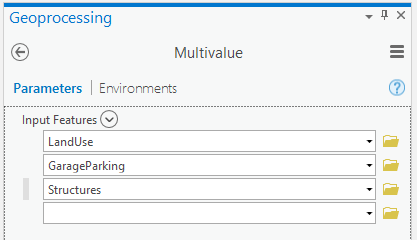
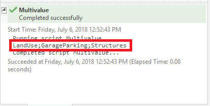
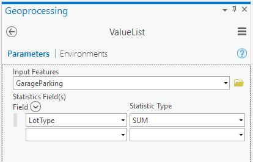
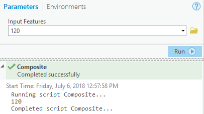
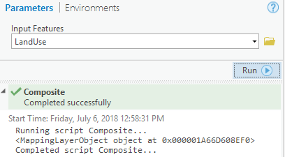
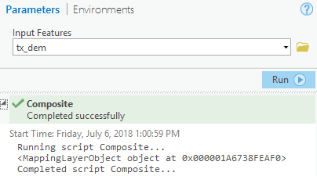
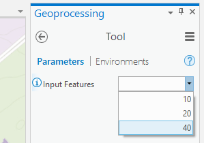

# TAMU GIS Programming
# Learning Objectives
- Explain how multivalue parameters work
- Detail how to work with composite parameters
<!-- - Iterate through list of input and perform processing -->
<!-- # Working with multivalue tool inputs -->
# Arcpy advanced tool parameters
When we worked on our toolbox in the earlier lectures, we assumed the user would only be working from the **Structures** layer found in the Campus geodatabase. Assumptions are good for simple scripts, but once you create a tool from your script, the user is probably going to want to supply a layer for input. Or what if you've created a tool that works off of several layers? If your tool requires people to modify the underlying Python in order for them to use it, they probably won't keep using such a tool.
>
In order to fix such issues, we will dive into some of the other tool inputs one can use inside a tool. Unfortunately there are no one-size-fits-all solutions for parameter inputs, so it is up to the developer to select an input parameter type that best fits the required inputs.
>
# Advanced input parameter types
## Multivalue
Just as the name suggests, **multiValue** allows your tool to take several values for the same input. Say you have a tool who needs to create several buffers of varying sizes, you would need a multivalue input. Or if you needed to clip several layers, you wouldn't want the user to add them in by editing your script, you'd just provide a multivalue parameter.
>
```python
def getParameterInfo(self):
    """Define parameter definitions"""
    param0 = arcpy.Parameter(
        displayName="Input Features",
        name="in_features",
        datatype="GPFeatureLayer",
        parameterType="Required",
        direction="Input",
        multiValue=True)

    params = [param0]
    return params

```
>

>
When you use a multivalue parameter, getting the value from said parameter can now be a little tricky. If we get the value using **param0.valueAsText**, we will end up with a semi-colon separated string containing all the values provided to the multivalue input. It is up to you to then split the string to get the actual values.
>

>
Below you can find some code that will separate out the different values present in the multivalue parameter.
>
```python
def execute(self, parameters, messages):
    """The source code of the tool."""
    # Iterate through all parameters
    for param in parameters:
        # Set a variable equal to the string value of the current parameter
        paramVal = param.valueAsText
        # Split the variable paramVal on semi-colons; this gives us a list of inputs provided to the multivalue param
        tokens = paramVal.split(";")
        # Iterate through all the inputs in the list (the tokens)
        for token in tokens:
            # Print out each token value
            arcpy.AddMessage(token)
    return

```
>
## Value Table
A **Value table** is a type of input that allows you to specify multiple entries. These entries can be any of the standard parameter data types such as feature classes, fields, strings, et cetera. 
>
```python
def getParameterInfo(self):
    param0 = arcpy.Parameter(
        displayName ='Input Features',
        name ='in_features',
        datatype ="GPFeatureLayer",
        parameterType ='Required',
        direction ='Input')

    param1 = arcpy.Parameter(
        displayName='Statistics Field(s)',
        name='stat_fields',
        datatype='GPValueTable',
        parameterType='Required',
        direction='Input')

    param1.parameterDependencies = [param0.name]
    param1.columns = [['Field', 'Field'], ['String', 'Statistic Type']]
    param1.filters[1].type = 'ValueList'
    param1.values = [['NAME', 'SUM']]
    param1.filters[1].list = ['SUM', 'MIN', 'MAX', 'STDEV', 'MEAN']
    params = [param0, param1]
    return params

def execute(self, parameters, messages):
    """The source code of the tool."""
    for param in parameters:
        paramText = param.valueAsText
        tokens = paramText.split(" ")
        layer = tokens[0]
        field = tokens[1]
        stat_field = tokens[2]
    return
```
>

>
You can get the values from a value table by splitting the parameter value with a single space character. This will return three strings: the layer given as input, the field chosen and the statistical field value selected.
## Composite parameters
Sometimes you will want your tool parameter to accept a variety of different data types requiring you to use what's known as a **composite parameter**. A **composite parameter** is a parameter that accepts multiple data types. These data types are defined as a list and set to the parameters **datatype** attribute.
>
```python
    def getParameterInfo(self):
        """Define parameter definitions"""
        param0 = arcpy.Parameter(
            displayName="Input Features",
            name="in_features",
            datatype=["GPFeatureLayer", "GPLayer", "GPRasterDataLayer", "GPLong"],
            parameterType="Required",
            direction="Input")
        params = [param0]
        return params

    def execute(self, parameters, messages):
        """The source code of the tool."""
        for param in parameters:
            # This will print out the value for each parameter, regardless of its datatype
            arcpy.AddMessage(param.valueAsText)
        return
```
>
A composite parameter such as the one defined above handles a variety of different input types without issue. The three images below show how this single parameter handles all these input types without breaking a sweat.
>

> ##### An integer as an input to the parameter

> ##### A feature class as an input to the parameter

> ##### A raster layer as an input to the parameter
>
## Derived
You can also have a parameter that is known as **derived**. These parameters depend on a previous parameter being fulfilled before they *activate*. Consider the following example:
>
```python
def getParameterInfo(self):
    """Define parameter definitions"""
    param0 = arcpy.Parameter(
        displayName="Input Features",
        name="in_features",
        datatype="GPFeatureLayer",
        parameterType="Required",
        direction="Input")

    param1 = arcpy.Parameter(
        displayName="Output Features",
        name="out_features",
        datatype="GPFeatureLayer",
        parameterType="Derived",
        direction="Output")

    param1.parameterDependencies = [param0.name]

    params = [param0, param1]
    return params
def execute(self, parameters, messages):
    """The source code of the tool."""
    for param in parameters:
        arcpy.AddMessage(param.valueAsText)
    return
```
>
The parameter called **param1** has a parameterType of **Derived**. This means that **param1** is dependent on some other parameter. The next line uses the **parameterDependencies** attribute to set which parameter is param1 dependent on; in this case param0. 
>
Getting out the value of a derived parameter is the same as getting a value out of any plain parameter type; we just use the **value** or **valueAsText** attributes.
>
# Default values
In addition to having the user input the value of a parameter, we can also set default values for the convenience of the user based off their environment settings. To set a default value, simply set the parameters **value** attribute within the **getParameterInfo()** method. You may see usage of a particular parameter attribute **defaultEnvironmentName**. This particular attribute is used for setting the default environment for the parameter, not a default value.
>
```python
def getParameterInfo(self):
    param0 = arcpy.Parameter(
        displayName="Input Workspace",
        name="in_workspace",
        datatype="DEWorkspace",
        parameterType="Required",
        direction="Input")

    param1 = arcpy.Parameter(
        displayName="Buffer radius",
        name="bufferRadius",
        datatype="GPLong",
        parameterType="Required",
        direction="Input")

    # In the tool's dialog box, the first parameter will show 
    #  the workspace environment's value (if set)
    param0.defaultEnvironmentName = "workspace"

    # The default value for the buffer will be 25.5. This will show every time the tool is run.
    param1.value = 25.5
    params = [param0, param1]
    return params

def execute(self, parameters, messages):
    """The source code of the tool."""
    for param in parameters:
        arcpy.AddMessage(param.valueAsText)
        
    return
```
>
Just because a default value has been set does not mean that the user cannot change the value whenever they run the tool; defaults are supposed to make tool usage a little easier and less tedious.
>
# Advanced filters
## Value List
The **Value List** filter is useful for providing a set of values that the user can then choose from. A **Value List** differs from a multiValue in that with a multiValue you are free to select as many options as you want. A **Value List** limits your user's options to whatever you have specified ahead of time.
>
```python
def getParameterInfo(self):
    param0 = arcpy.Parameter(
        displayName="Input Features",
        name="in_features",
        datatype="GPLong",
        parameterType="Required",
        direction="Input")

    param0.filter.type = "ValueList"
    param0.filter.list = [10, 20, 40]

    params = [param0]
    return params

def execute(self, parameters, messages):
    """The source code of the tool."""
    for param in parameters:
        arcpy.AddMessage(param.valueAsText)
        
    return
```
>
To get the value out of a value list style parameter, we access the **value** or **valueAsText** attribute of the parameter.
>

>
## Feature Class
We can also use filters to limit the type of feature the user provides in the form of an input layer. Say we want to perform a clip somewhere in our tool code. What if a user passes in a point feature class? We could have code that checks for such situations, but we can also use a filter that will do the work for us. 
>
```python
def getParameterInfo(self):
    param0 = arcpy.Parameter(
        displayName="Input Features",
        name="in_features",
        datatype="GPFeatureLayer",
        parameterType="Required",
        direction="Input")
    param0.filter.list = ["Polygon"]
    params = [param0]
    return params

def execute(self, parameters, messages):
    """The source code of the tool."""
    for param in parameters:
        arcpy.AddMessage(param.valueAsText)
        
    return
```
>
We simply set the **filter.list** attribute of **param0** equal to a list that contains those geometry types that will work with the tool; in this case polygons. Since we are only limiting the type of geometry we are accepting, we can still access the parameter's value with **value** or **valueAsText** attributes.
>
## Categories
If you have a large amount of input's, you can categorize your inputs into collapsible sections. In order to do so, you only need to set the **category** attribute on your parameter to a string value. Those parameters with the same value for **category** will appear in the same section.
>
```python
def getParameterInfo(self):
    """Define parameter definitions"""
    param0 = arcpy.Parameter(
        displayName="Input Features",
        name="in_features",
        datatype="GPLong",
        parameterType="Required",
        direction="Input")

    param0.filter.type = "ValueList"
    param0.filter.list = [10, 20, 40]
    param0.category = "Test Tools"
    params = [param0]
    return params

def execute(self, parameters, messages):
    """The source code of the tool."""
    for param in parameters:
        arcpy.AddMessage(param.valueAsText)
        
    return
```
>

>
Categories do not alter parameters in any way, so we can use **value** or **valueAsText** to access the properties value.
>
# Additional resources
- http://desktop.arcgis.com/en/arcmap/10.3/analyze/creating-tools/defining-parameters-in-a-python-toolbox.htm
- http://pro.arcgis.com/en/pro-app/arcpy/geoprocessing_and_python/defining-parameters-in-a-python-toolbox.htm

## Videos
[Module7-Topic1](https://youtu.be/AJ1byLdejT8)