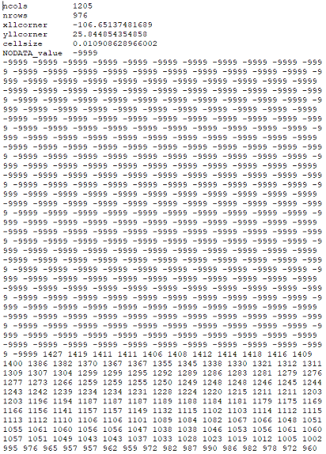
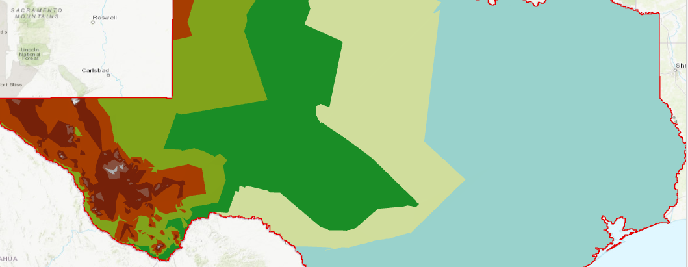
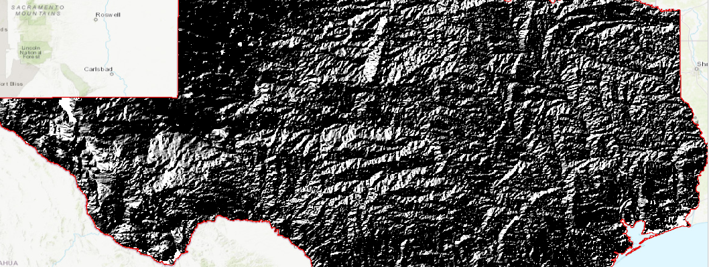
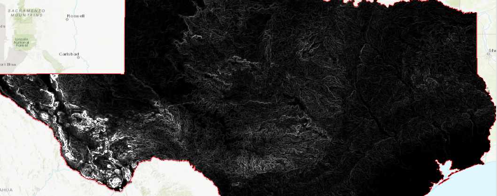

# TAMU GIS Programming
# Learning Objectives
- Discuss raster processing with arcpy
- Outline a few basic raster operations using arcpy

# Raster data
On many occasions, you will need to work with raster data in a scripting environment. Luckily, ArcPy provides access to a vast library of raster processing tools and techniques to get the job done. 

Since raster data processing is so integral to modern GIS, ArcPy raster processing capabilities are spread across several places in the ArcPy language. These include, but are not limited to:
- [Core ArcPy Raster Objects](http://pro.arcgis.com/en/pro-app/arcpy/classes/raster-object.htm);
- [3D Analyst Toolbox function](http://pro.arcgis.com/en/pro-app/tool-reference/3d-analyst/an-overview-of-the-3d-analyst-toolbox.htm);
- [Spatial Analyst Toolbox function](http://pro.arcgis.com/en/pro-app/arcpy/spatial-analyst/an-overview-of-spatial-analyst-classes.htm); and 
- [Data Management Toolbox](http://pro.arcgis.com/en/pro-app/tool-reference/data-management/make-raster-layer.htm)

Some of the most common raster tasks that you will be using ArcPy for include the following:
- [Converting from rasters to other things](http://pro.arcgis.com/en/pro-app/tool-reference/3d-analyst/raster-domain.htm);
- [Performing interpolation on raster data sets](http://pro.arcgis.com/en/pro-app/tool-reference/3d-analyst/an-overview-of-the-raster-interpolation-toolset.htm);
- [Creating a variety of outputs from a raster surface](http://pro.arcgis.com/en/pro-app/tool-reference/3d-analyst/an-overview-of-the-raster-surface-toolset.htm);
- [Classifying and reclassifying rasters](http://pro.arcgis.com/en/pro-app/tool-reference/3d-analyst/an-overview-of-the-raster-reclass-toolset.htm); and
- [Applying many different types of global, local, and zonal functions](http://pro.arcgis.com/en/pro-app/help/data/imagery/list-of-raster-functions.htm)

In this module, we will cover a very small subset of these operations which represents just the tip of the iceberg of the types of raster processing and analysis which are available in ArcPy.

# Data set
The input raster we use for the following examples can be downloaded [here](../data/modules/27/tx_dem). It is a digital elevation model covering the entire state of Texas.
Go ahead and create a new geodatabase and import the Texas DEM into your geodatabase.
# Raster to ASCII
>##### [Raster to ASCII documentation](http://pro.arcgis.com/en/pro-app/tool-reference/conversion/raster-to-ascii.htm)
>
```python
import arcpy
gdb = r"c:\Users\aaron\documents\ArcGIS\Projects\Mod27\Mod27.gdb"
input_raster = gdb + "/tx_dem"
output_file = r"C:/tmp/ArcGISPython/texas_dem_ascii.txt"
arcpy.conversion.RasterToASCII(input_raster, output_file)
```
>

>
# Raster to TIN
>##### [Raster to TIN documentation](http://pro.arcgis.com/en/pro-app/tool-reference/3d-analyst/raster-to-tin.htm)
>
```python
import arcpy
gdb = r"c:\Users\aaron\documents\ArcGIS\Projects\Mod27\Mod27.gdb"
z_tolerance = 250.3
max_points = 1500000
z_factor = 1
arcpy.ddd.RasterTin(gdb + "/tx_dem", gdb + "/tx_dem_tin", z_tolerance, max_points, z_factor)
```
>

>
# Hillshade
>##### [Hillshade documentation](http://pro.arcgis.com/en/pro-app/help/data/imagery/hillshade-function.htm)
>
```python
import arcpy
gdb = r"c:\Users\aaron\documents\ArcGIS\Projects\Mod27\Mod27.gdb"
azimuth = 315
altitude = 45
shadows = "NO_SHADOWS"
z_factor = 1
arcpy.ddd.HillShade(gdb + "/tx_dem", gdb + "/tx_hillshade", azimuth, altitude, shadows, z_factor)
```
>

>
# Slope
>###### [Slope documentation](http://pro.arcgis.com/en/pro-app/help/data/imagery/slope-function.htm)
>
```python
import arcpy
gdb = r"c:\Users\aaron\documents\ArcGIS\Projects\Mod27\Mod27.gdb"
output_measurement = "DEGREE"
z_factor = 1
method = "PLANAR"
z_unit = "METER"
arcpy.ddd.Slope(gdb + "/tx_dem", gdb + "/tx_dem_slopes",output_measure, z_factor, method, z_unit)
```
>

>

# Raster calculator
If you planned on using the **Raster Calculator** tool within a Python script, I'm sorry to inform you that it is *NOT* supported by arcpy. The Raster Calculator web page has a warning box that states the following: "The Raster Calculator tool is intended for use in the application only as a GP tool dialog box or in ModelBuilder. It is not intended for use in scripting and is not available in the ArcPy Spatial Analyst module." The odd thing being if you use the resulting Python from a Raster Calculator within ArcGIS Pro (using the "Copy Python command" option upon the successful completion of a raster calculation) in a script, arcpy will still fail and not let you use it. [Here](http://desktop.arcgis.com/en/arcmap/10.6/tools/spatial-analyst-toolbox/raster-calculator.htm) is a link to the Raster Calculator web page.
>
# Additional resources
- http://pro.arcgis.com/en/pro-app/help/data/imagery/list-of-raster-functions.htm


## Videos
[Module7-Topic2](https://youtu.be/lsAj_-193BE)