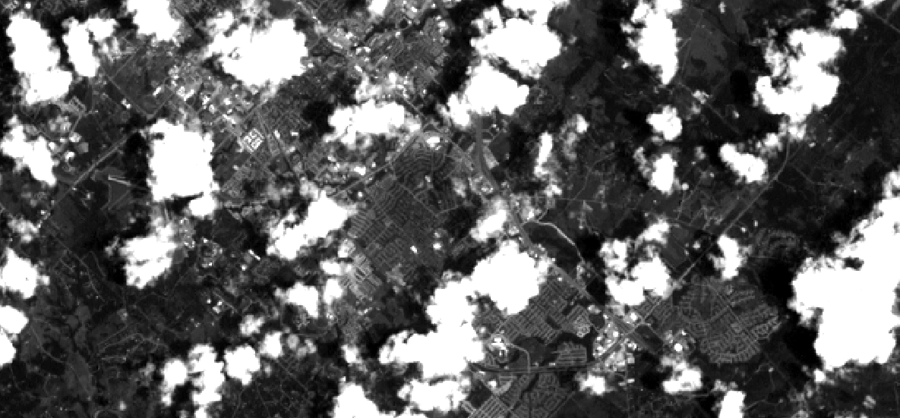
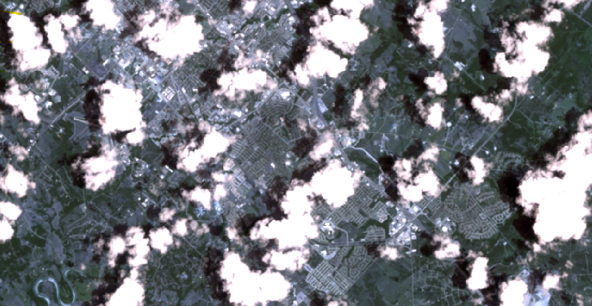
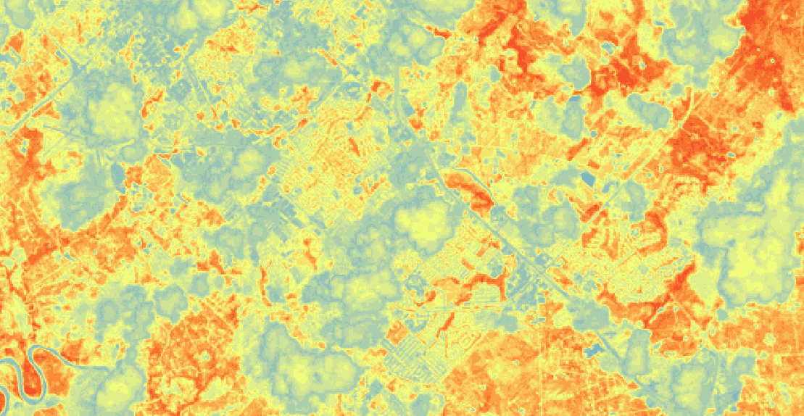

# TAMU GIS Programming
# Learning Objectives
- Learn how to create a composite raster with arcpy
- Detail how to create NDVI imagery with a composite raster
# The data
For this lecture, we will be working with four different raster layers that are provided by LandSat 7's ETM+ sensor. This sensor can produce images in a variety of wavelengths ranging from visibile, to near infrared, to thermal. The data set used is four raster layers, each one representing a different band of the spectrum. We will combine all of the rasters into a **composite** raster. Once we have our composite raster, we will create a **Normalized Difference Vegetation Index** map, or NDVI. Our study area is a large swath of south-east Texas encompassing Brazos, Grimes, and Washington counties.
>
The data for this lecture can be found [here](https://drive.google.com/open?id=1JZOXaaYUVhbGGJmIhFBgxMHBWpJwkSSd). Be warned, the entire data set is roughly 200MB. Go ahead and download the four required rasters.
# Composite imagery
For the first part of the lecture, we will create a **composite** raster that combines all four rasters you downloaded. If you were to load each layer individually into ArcGIS Pro, you will see a black and white raster. This is because each of the rasters labeled B1.TIF through B3.TIF represent the colors blue, green, and red respectively. Each raster itself only contains the information for a single color. It is when we combine these layers together that we get a nice multi-colored composite raster. 
>
To accomplish this, we first need to import the arcpy module. Once the module is added, we need to reference our working directory either by setting it as your workspace or by using a simple path string like what you see below. After the source is set, we create four variables, with each one referencing a different raster (or band). It is important to note that LandSat 7 defines the color bands in a very specific way e.g. band 1 represents blue data, band 2 represents green data, band 3 represents red data, and finally band 4 represents infrared. Using **sa.Raster()**, we can get a reference to each raster file and set that equal to a variable.
>
```python
import arcpy
source = r"D:/DevSource/Tamu/GeoInnovation/_GISProgramming/data/modules/28/LS7/"
band1 = arcpy.sa.Raster(source + "B1.TIF") # blue
band2 = arcpy.sa.Raster(source + "B2.TIF") # green
band3 = arcpy.sa.Raster(source + "B3.TIF") # red
band4 = arcpy.sa.Raster(source + "B4.TIF") # NIR
```
>

>##### This is what the B1.TIF raster looks like
With our raster variables defined, we simply call arcpy's **CompositeBands_management()** method to create our composite imagery. This method takes two parameters: a list of raster inputs, and the output path and name. ESRI's documentation for **CompositeBands_management()** states that to get a true color composite image you need to provide the input rasters in the following order: red first, blue second, and green third. I've found when doing this that you do not indeed get a true color composite image. Just go ahead and set the input raster order to 1, 2, 3, 4.
>
```python
import arcpy
source = r"D:/DevSource/Tamu/GeoInnovation/_GISProgramming/data/modules/28/LS7/"
band1 = arcpy.sa.Raster(source + "B1.TIF") # blue
band2 = arcpy.sa.Raster(source + "B2.TIF") # green
band3 = arcpy.sa.Raster(source + "B3.TIF") # red
band4 = arcpy.sa.Raster(source + "B4.TIF") # NIR
composite = arcpy.CompositeBands_management([band1, band2, band3, band4], source + "combined.tif")
```
>
Once run, you should get an image that looks something like the one below. This is centered just about over Texas A&M's campus.
>

>
# NDVI
Now that we have a composite image, we can create a Normalized Difference Vegetation Index image, or NDVI. This image type is a way of quantifying healthy vegetation. We can create this image using two of the raster's we combined into our composite raster: red and infrared. Using some simple raster math, we can easily create a raster representing the NDVI of our area. There are two ways of calculating NDVI, the normal way or the way ESRI calculates NDVI; both formulas are shown below.
>
To calculate NDVI, we must follow the following formula:
>
`# ESRI_NDVI = ((IR - R) / (IR + R)) * 100 + 100`</br>
`# NDVI = ((IR - R) / (IR + R))`
>
The great thing about raster calculations with arcpy is that we can treat a raster as a single operand in raster arithmetic. We can add two rasters together just like we would any two integers by using the '+' symbol. This works for addition, subtraction, multiplication, and division.
>
To calculate NDVI, we create a new variable **esri_ndvi** and **ndvi**. We then apply the formula with what we know about LandSat 7 imagery, e.g. band 3 is red and band 4 is infrared. We then use the raster method **save()** to save the resulting raster to the file system. 
>
```python
esri_ndvi = ((band4 - band3) / (band4 + band3)) * 100 + 100
esri_ndvi.save(source + "esri_ndvi.tif")
ndvi = ((band4 - band3) / (band4 + band3))
ndvi.save(source + "ndvi.tif")
```
>
And after you play around with the raster symbology, you should end up with something that looks like this:
>

>
# Additional resources
- http://desktop.arcgis.com/en/arcmap/10.3/manage-data/raster-and-images/ndvi-function.htm
- https://gisgeography.com/how-to-ndvi-maps-arcgis/
- https://landsat.usgs.gov/what-are-band-designations-landsat-satellites
- http://pro.arcgis.com/en/pro-app/tool-reference/data-management/composite-bands.htm


## Videos
[Module7-Topic3](https://youtu.be/edbCj75Rp_o)