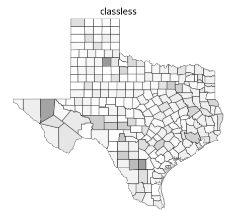
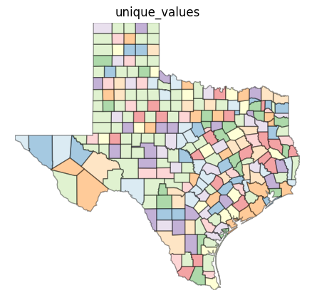
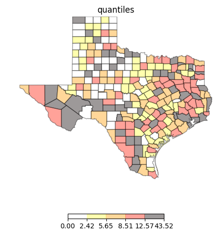

# TAMU GIS Programming
# Learning Objectives
- Import PySAL
- Perform data conversion between PySAL & ArcGIS
- Perform data analysis with PySAL
# What is PySAL?
**Python Spatial Analysis Library** or PySAL is an open source library of spatial analysis functions written in Python intended to support the development of high level applications. PySAL is a Python package that contains several sub-packages, each one geared towards a specific area of spatial analysis. The different sub-packages can be found below:
>
- pysal.cg - Computational Geometry
- pysal.core - Core Data Structures and IO
- pysal.esda - Exploratory Spatial Data Analysis
- pysal.inequality - Spatial Inequality Analysis
- pysal.region - Spatially Constrained Clustering
- pysal.spatial_dynamics - Spatial Dynamics
- pysal.spreg - Regression and Diagnostics
- pysal.weights - Spatial Weights
- pysal.network - Network Constrained Analysis
- pysal.contrib - Contributed Modules
>
PySAL still has a while to go before it can replace the likes of arcpy, but it is still quite the viable option for doing spatial analysis in Python.
>
# Installing PySAL
You can install PySAL using the **pip** Python package manager. Simply open up a command prompt and type in the following command: `python -m pip install pysal`. This should download PySAL and all of its required dependencies. Once the package has been downloaded it will then install the package to your Python installation.
>
# What can PySAL do?
PySAL isn't the end all of Python based GIS libraries; it is definitely more aimed towards research and spatial statistics. Think of PySAL as a very specific tool while arcpy is more of a Swiss army knife.
>
Some basic PySAL Python code is found below. This will create five different maps each with a different classification method.
>
```python
    import numpy as np
    import pysal as ps
    from pysal.contrib.viz import mapping as maps
    shp = ps.open(r"D:\DevSource\Tamu\GeoInnovation\_GISProgramming\data\modules\30\texas.shp")
    dbf = ps.open(r"D:\DevSource\Tamu\GeoInnovation\_GISProgramming\data\modules\30\texas.dbf")
    values = np.array(ps.open(r"D:\DevSource\Tamu\GeoInnovation\_GISProgramming\data\modules\30\texas.dbf").by_col("HR90"))
    types = ["classless", "unique_values", "quantiles", "equal_interval","fisher_jenks"]
    for typ in types:
        maps.plot_choropleth(r"D:\DevSource\Tamu\GeoInnovation\_GISProgramming\data\modules\30\texas.shp",values,typ,title=typ)
```
>
Below are a few example maps of what you can do using PySAL:
>

>

>

>


# Additional resources
- https://github.com/pysal/pysal/wiki/PySAL-Visualization-Project