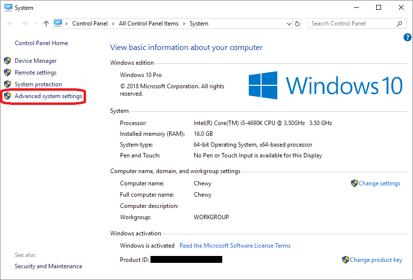
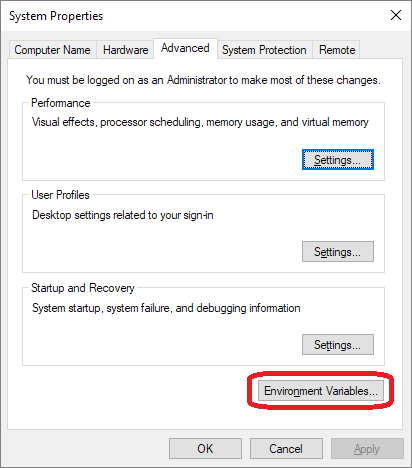
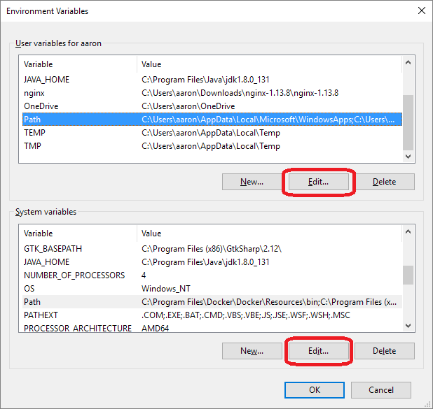
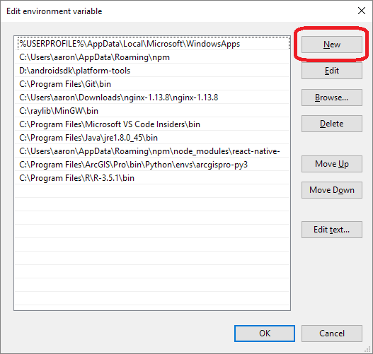
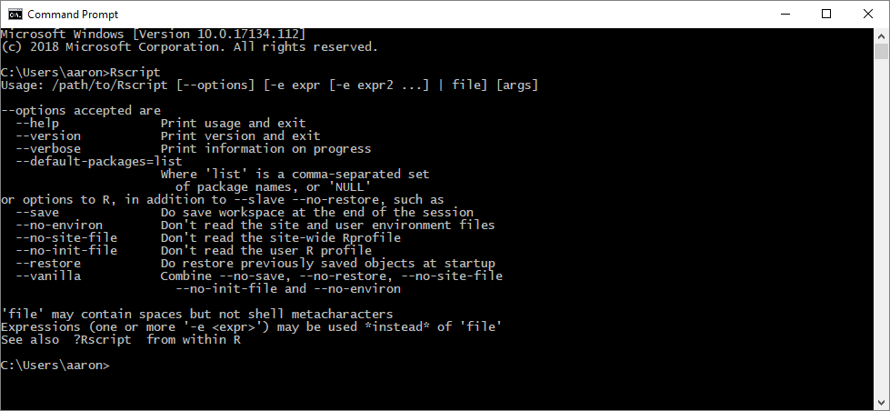
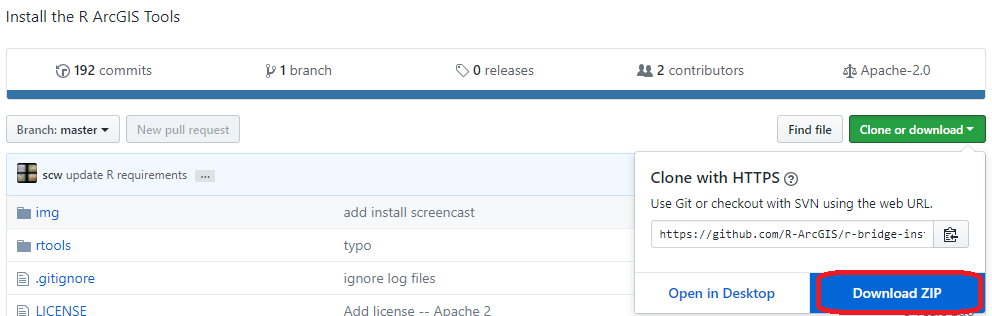
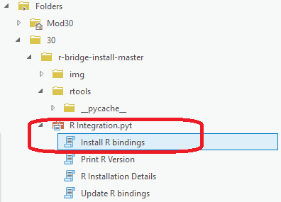

# TAMU GIS Programming
# Learning Objectives
- Install R
- Install [R-ArcGIS Bridge](https://github.com/R-ArcGIS/r-bridge-install)
<!-- - Perform data conversion between R & ArcGIS
- Perform data analysis with R -->
# What is R?
**R** is a free, statistical computing and graphics programming language supported by the R Foundation for Statistical Computing. Quite popular around the world with statisticians, scientists, data miners, and researchers, R has been growing in popularity since its introduction. Until recently, it was quite a chore to get R to interface with ArcGIS requiring an intermediate step of running R within Python then Python to ArcGIS. Now thanks to ESRI's R-ArcGIS Bridge, we can run R scripts directly from ArcGIS as a tool.
>
# Installing R
Head to R's website [here](https://cran.r-project.org/mirrors.html) and look for a download mirror location near you and download a precompiled binary distribution that matches your platform of choice (Linux, OSX, Windows). Once the installer has finished downloading, go ahead and install R to your computer choosing default save locations and settings along the way. 
>
You may run into the case where if you type in a new command line / terminal the following command `Rscript` that you get a command not found error. In Windows, this is fixed by adding the **bin** folder inside your R install directory to your system Path variable. Instructions on how to fix this issue are found below.
>
Press the **Windows key** plus **Pause / Break** to bring up the **System** window.
>

>
Click on the **Advanced system settings** option on the left-hand pane.
>

>
On the **System Properties** window popup, click on the **Environment Variables...** button to bring up your **Environment Variables** window.
>

>
From here you should select the **Path** variable both inside your **User variables** and **System variables** sections (each has it's own **Path**) and select **Edit**.
>

>
With the **Edit environment variable** window and editing the **Path** variable, go ahead and click **New** and paste in the path to your R installation's **bin** folder. If you used the default save location it should look something like this: `C:\Program Files\R\R-3.5.1\bin`. Once you've pasted in the location press enter then **OK**.
>
Open up a brand new Command Prompt and type `Rscript`; you should get a message like the one below.
>

>
# Installing R-ArcGIS Bridge
The R-ArcGIS Bridge is a set of Python scripts that when run inside ArcGIS Pro, will allow you to interact with ArcGIS from R. You can download the required files and scripts from the project's GitHub page located [here](https://github.com/R-ArcGIS/r-bridge-install). Go ahead and click the **Download ZIP** button; this will download the required files for you. Once downloaded, extract the .zip file to a memorable location.
>

>
Once extracted, open up ArcGIS Pro and create a Folder Connection to the folder you just extracted.
>

>
Look for the **R Integration** Python toolbox and run the **Install R bindings** tool found inside. Click **Run** to have this tool install the R bridge. To check that everything went well, after installing the bridge run the **Print R Version** tool. You should see a result like the one below. If so, you should be ready to proceed.
>

>
# Additional resources
- https://r-arcgis.github.io/
- https://github.com/R-ArcGIS/r-bridge-install
- https://r-arcgis.github.io/assets/arcgisbinding.pdf
- https://esricanada-ce.github.io/r-arcgis-tutorials/3-R-ArcGIS-Scripting.nb.html
