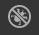
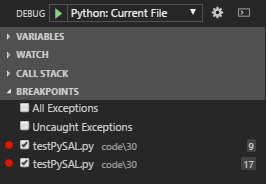
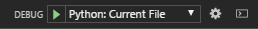
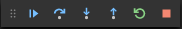
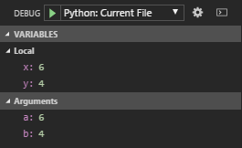
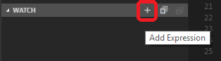
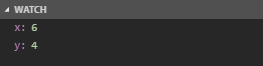
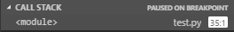
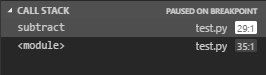

# TAMU GIS Programming
# Learning Objectives
- Describe how to debug Python
# Debugging
One of the most important parts of writing code in any language or platform is what is called **debugging**. You will undoubtedly write code at some point only for you to find out that it doesn't run properly. You may end up with an error that crashes your Python terminal. Maybe it even causes ArcGIS to crash. Sometimes you'll end up with values that do not make any sense or maybe your code doesn't run at all. What are you supposed to do?
>
This is where debugging comes into play. Think of debugging as a way to run through your code line by line and investigate variable values or pinpoint the order of operation. In this lecture we will be focusing on two very important parts of debugging: variable watching and breakpoint setting.
# Debugging Python within Visual Studio Code
Debugging Python within Visual Studio Code is surprisingly simple once you have the Python Extension installed. Have you ever once wondered what this  icon on the side pane did? When clicked it will expand VSCode's debug pane.
>

>
To start debugging, we simply look at the top for this section:
>

>
When you click the play button (green triangle), you will start the debug process. The debug pane will come to life with several different values place in different categories. The four categories are: **variables**, **watch**, **call stack**, and **breakpoints**. These catagories will be explained in detail below.
>
## Breakpoints
**Breakpoints** are one of the most important parts of debugging: without breakpoints debugging would be a lot less useful in my opinion. Breakpoints tell the Python interpreter to stop executing code once the breakpoint has been reached. To set a breakpoint, we can either click on the + sign to the right of the breakpoints category header, or click the space to the left of any line number. You know a breakpoint has been set when you see the little red dot. The image below shows an example breakpoint at line 25.
>

>
We can place as many breakpoints within our script as we want; there are no limits. A currently activated breakpoint, within VSCode, will highlight the entire line in yellow as seen on line 25 in the image above. A non-activated breakpoint will just show a little red dot to the left of the line number. When a breakpoint is activated it will also show a little toolbar near the top of VSCodes menu bar that looks like this:
>

>
This toolbar is what we use to control the progress of the program. Using this toolbar, we can choose to go to the next breakpoint in the program, go to the next line and stop, step into a function, step out of a function, restart the currently running program, or stop the currently running program. 
>
## Variables
The **variables** category lists all the variables and their current values at the present part of the code. In the picture to the right and below we have a breakpoint being activated at line 25. This breakpoint is denoted by the yellow highlight. This causes the code to stop executing until the user has told it to continue. At this moment in time, at line 25, we have 4 variables: two local and two as arguments. The category lists the variable name on the left side of the colon and the variable's current value on the right side of the colon.
>


>
## Watch
The **watch** category is useful for *watching* the value of specific variables without having to look through the variables category. If you have anymore than 10 or so variables cluttering up your variables section, the last thing you want to do is have to search for it. The great thing about debugging is you can **watch** certain variables and have their values presented inside the watch category instead. We *should* be able to right click a variable from within the variables category and click **Add to Watch**. But if VSCode doesn't allow you to do so you can press the + sign within the watch category and type in the name of the variable you wish to add.
>

>
Doing so will add the variable to your watch category and will look like this:
>

>
## Call stack
The **call stack** category is used to see where inside the call stack the code currently is. Consider the following Python code:
>
```python
def add(a, b):
    print("x: ", x)
    print("y: ", y)
    return x + y
def subtract(i, k):
    print("x: ", x)
    print("y: ", y)
    return x - y
x = 6
y = 4
add(x, y)
subtract(x, y)
```
>
If we were to set a breakpoint at the line of code labeled `subtract(x, y)` and looked at the call stack once the breakpoint has been activated, you will see the following:
>

>
And if we set a breakpoint at the line labeled `print("x: ", x)` within the subtract function, you will see the following. 
>

>
This doesn't seem to useful when our program is confined to a single Python page, but once your project grows and spans many modules, the callstack category can help you pinpoint issues and trace the progression of your code.
>
# Debugging arcpy
Unfortunately there are no easy ways to debug arcpy-based tools. ESRI recommends to use the `arcpy.AddMessage()` function to print values to the screen. This is clunky to say the least, but it is something to consider using. The other way to get around this is to copy your tool's **execute()** function into a stand-alone arcpy script and debug using the debug tool in your IDE such as VSCode.

# Additional resources
- http://desktop.arcgis.com/en/arcmap/10.3/analyze/creating-tools/debugging-script-tools.htm
- http://pro.arcgis.com/en/pro-app/arcpy/get-started/debugging-python-code.htm