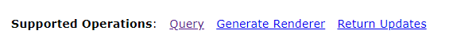
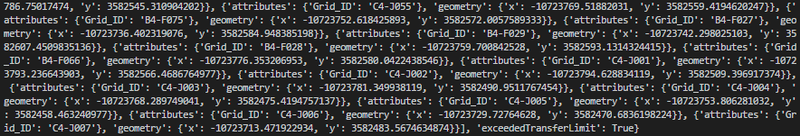

# TAMU GIS Programming
# Learning Objectives
- Pull data using REST from ESRI ArcServer, as JSON, and convert into feature class
<!-- - Sending email -->
<!-- - Format data as JSON; push to server -->
# GETting data from REST
When using code to grab information from a website or sever, chances are you'll do so using **REST**. REST, or Representational state transfer, is a set of constraints used to interact with web services. These constraints allow users to interact with web services offered by different people and organizations in the same manner without knowing any particular details about an individual web service. There are many different methods of REST, each with its own purpose such as getting a response, pushing data to a server, and so on. We use the REST method **GET** when we want to *get* data from a web service. Clever huh?
>
We can use REST to grab feature data programmatically from an ESRI ArcServer installation and use that feature data in our Python scripts. For this part of the lecture we will use Python to grab a feature data from a published feature class.
>
The first thing you'll want to check is to make sure your selected feature class supports **Query**. If you scroll to the bottom of an individual layer's page on ArcServer, you should see something like this:
>

>
This means we can use REST to get data from the ArcServer. In order to do so we must first import two packages: arcpy and **requests**. **Requests** is a built-in Python package that allows us to make REST calls programmatically. With these modules imported, we can move onto setting up **requests**. When making a GET call to an ArcServer, we need to create a **query string**. The query string is passed to requests which, in turn, uses the query string as a directory of where it should get data from and what data it will get. 
>
Below we have three variables, two that define what data we want returned to us, and one that tells requests where to get the data from. The variable **response_format** is used to tell ArcServer the format we want our data to be given to us in. If we do not tell ArcServer, it will return the data in XML format, which isn't useful to arcpy. The second variable **where_clause** is exactly like a where clause used in a Python cursor object. We use it to determine which data we want back, in this case we want ALL the data present in the feature layer. The last variable is **query_url** which is a formatted Python string that provides the URL to the ArcServer feature layer as well as the two parameters **response_format** and **where_clause**.
>
Once we have those three variables created, we start our GET request using the requests package. We use **requests.get()** and **query_url** as a parameter to GET our data from ArcServer and set the response equal to a variable named **response**. After this is done, we simply print out the result of **response.json()** and we get a simple, easy to read response from the server printed to the Python terminal.
>
```python
import arcpy
import requests

response_format = "pjson"
where_clause = "objectid+>+0"
query_url = "https://gis.tamu.edu/arcgis/rest/services/FCOR/BaseMap_051118/MapServer/9/query?where=%s&f=%s" % (where_clause, response_format)
response = requests.get(query_url)
print(response.json())
```
>

> ##### The result of response.json()
>
Now that we have our response in JSON format, we need to get it into ArcGIS Pro. In order to get JSON into a feature layer, we need to first write the JSON **response** to a file. Once the JSON is in a file we can use that file as the input for arcpy's **JSONToFeatures_conversion()** method.
>
In order to write a file, we use the **open()** method from before to create the file; simply provide the path you want the file to be created in and make sure to also use **w** as your second parameter for write. The Python structure below simply opens a file (or creates it if not found) and gives that value to a new variable named **file**. We then iterate through **response**'s actual content value and write this to **file**.
>
```python
with open(r"C:/tmp/ArcGISPython/json_response.json", "w") as file:
    for chunk in response.iter_content(chunk_size=1024):
        if chunk:
            file.write(chunk)
```
>
Once we have a JSON file that contains the response content, we can use the following arcpy method to output the JSON as a feature class; the first parameter is the path to the JSON file we created while the second parameter is the path for the newly created feature class.
>
```python
arcpy.JSONToFeatures_conversion(r"C:/tmp/ArcGISPython/json_response.json", r"C:/tmp/ArcGISPython/Test.gdb/trees")
```
>
## The whole thing
>
```python
import arcpy
import requests

response_format = "pjson"
where_clause = "objectid+>+0"
query_url = "https://gis.tamu.edu/arcgis/rest/services/FCOR/BaseMap_051118/MapServer/9/query?where=%s&f=%s" % (where_clause, response_format)
response = requests.get(query_url)
response_json = response.json()

with open(r"C:/tmp/ArcGISPython/json_response.json", "wb") as file:
    for chunk in response.iter_content(chunk_size=1024):
        if chunk:
            file.write(chunk)

arcpy.JSONToFeatures_conversion(r"C:/tmp/ArcGISPython/json_response.json", r"C:/tmp/ArcGISPython/Test.gdb/trees")
```
>
<!-- # POSTing data with REST -->
# Additional resources
- https://en.wikipedia.org/wiki/Representational_state_transfer
- https://www.w3schools.com/tags/ref_urlencode.asp